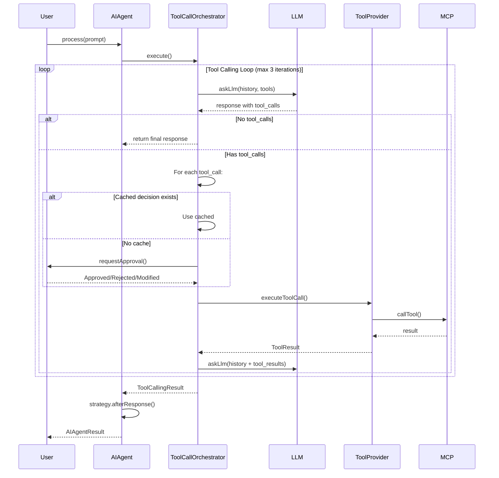

# ToolCallOrchestrator — Архитектурный анализ и улучшения

> Дата: 2026-03-21
> Автор: AI Architect

## Оглавление

1. [Общая архитектура](#архитектура)
2. [Анализ OpenRouter tool calling](#openrouter-tool-calling)
3. [Выявленные проблемы](#проблемы)
4. [Архитектурные улучшения](#улучшения)
5. [Implementation Phases](#phases)

---

## Phases

Разбито на отдельные файлы для удобства:

| Phase | Файл | Приоритет | Сложность |
|-------|------|-----------|-----------|
| Phase 1: Fix `name` field | [phase-1-fix-name-field.md](phase-1-fix-name-field.md) | P0 | Low |
| Phase 2: UITL Core | [phase-2-uitl-core.md](phase-2-uitl-core.md) | P1 | High |
| Phase 3: Config + Idempotency | [phase-3-config-idempotency.md](phase-3-config-idempotency.md) | P2 | Low |
| Phase 4: Future Enhancements | [phase-4-future-enhancements.md](phase-4-future-enhancements.md) | P3 | Medium |

---

## Быстрый обзор Implementations

---

## Архитектура

### Цепочка зависимостей

```
ToolCallOrchestratorImpl
├── LlmRequestUseCase (interface)
│   └── LlmRequestUseCaseImpl
│       └── LlmRepository
│           └── RemoteLlmApi → OpenRouter API (https://openrouter.ai/api/v1/chat/completions)
│
└── ToolProvider (interface)
    └── McpToolProvider
        ├── McpRepository (MCP servers)
        ├── McpTools (tool execution)
        └── AgentMemoryRepository (per-agent restrictions)
```

### Flow выполнения



---

## OpenRouter Tool Calling

### Спецификация OpenRouter

OpenRouter использует стандартный tool calling формат OpenAI:

```json
// Assistant message с tool_calls
{
  "role": "assistant",
  "tool_calls": [
    {
      "id": "call_abc123",
      "type": "function",
      "function": {
        "name": "get_weather",
        "arguments": "{\"location\":\"Boston\"}"
      }
    }
  ]
}

// Tool response message
{
  "role": "tool",
  "tool_call_id": "call_abc123",
  "name": "get_weather",  // <-- CRITICAL: name field required
  "content": "{\"temperature\":\"72°F\",\"conditions\":\"sunny\"}"
}
```

### Что корректно реализовано

- ✅ Assistant message с `tool_calls` содержит `id`, `type`, `function.name`, `function.arguments`
- ✅ Tool response message содержит `tool_call_id`
- ✅ Final response возвращается когда `toolCalls.isNullOrEmpty()`
- ✅ Разделение memory/history — `memoryMessages` не сохраняются в БД
- ✅ Namespace для инструментов через `serverId:toolName`

---

## Проблемы

### P0 — Critical

| # | Проблема | Файл | Строка | Описание |
|---|----------|------|--------|----------|
| 1 | Missing `name` field | `ModelRequest.Message` | — | Tool response НЕ содержит `name` — нарушение OpenRouter spec |
| 2 | Missing `name` field | `ToolCallOrchestratorImpl` | 148 | `// TODO нет имени функции` |

### P1 — High

| # | Проблема | Файл | Строка | Описание |
|---|----------|------|--------|----------|
| 3 | Hardcoded `MAX_TOOL_LOOPS = 3` | `ToolCallOrchestratorImpl` | 35 | Magic constant, нет способа динамически менять |
| 5 | No User in The Loop | All | — | Все tool calls выполняются автоматически |

### P2 — Low Priority (Future Recommendation)

| # | Проблема | Файл | Строка | Описание |
|---|----------|------|--------|----------|
| 4 | Sequential tool execution | `ToolCallOrchestratorImpl` | 125 | Последовательное выполнение `for (call in toolCalls)`. Можно распараллелить через `coroutineScope { launch { } }` если потребуется. **Приоритет: очень низкий** — выигрыш в скорости минимален для большинства случаев.

### P2 — Medium

| # | Проблема | Файл | Строка | Описание |
|---|----------|------|--------|----------|
| 6 | No cancellation support | `ToolCallOrchestrator` | — | Нет способа прервать цикл извне |
| 7 | Tool errors не классифицируются | `ToolCallOrchestratorImpl` | 175 | Нет区分 transient vs permanent errors |
| 8 | Mixed domain/data models | `ToolCallOrchestratorImpl` | 217 | `toAContextMessages()` — data mapping в domain layer |

### P3 — Low

| # | Проблема | Файл | Строка | Описание |
|---|----------|------|--------|----------|
| 9 | No retry on transient errors | `McpToolProvider` | — | При network timeout нет retry |
| 10 | No idempotency | `ToolCallOrchestratorImpl` | 125 | При duplicate tool calls оба выполнятся |

---

## Улучшения

### 1. Исправить missing `name` field

**Файлы для изменения:**

- `app/src/main/java/com/example/day/core/core_features/llm/domain/model/ModelRequest.kt`
- `app/src/main/java/com/example/day/core/core_features/agent/domain/tools/impl/ToolCallOrchestratorImpl.kt`
- `app/src/main/java/com/example/day/core/core_features/llm/domain/LlmRequestUseCaseImpl.kt`

**ModelRequest.Message:**

```kotlin
data class Message(
    val role: Role,
    val content: String,
    val thinking: String? = null,
    val cachePrompt: Boolean? = null,
    val toolCalls: List<ToolCall>? = null,
    val toolCallId: String? = null,
    val name: String? = null  // ← Добавить для role=Tool
)
```

**ToolCallOrchestratorImpl — tool message creation (line ~143):**

```kotlin
toolMessages.add(
    ModelRequest.Message(
        role = ModelRequest.Role.Tool,
        content = content,
        toolCallId = call.id,
        name = call.function.name  // ← Использовать
    )
)
```

### 2. Configurable tool calling config

```kotlin
data class ToolCallingConfig(
    val maxLoops: Int = 3,
    val timeoutPerTool: Duration = 30.seconds,
    val parallelExecution: Boolean = true,
    val retryPolicy: RetryPolicy = RetryPolicy()
)

data class RetryPolicy(
    val maxRetries: Int = 1,
    val backoff: Duration = 1.seconds,
    val transientOnly: Boolean = true
)
```

### 3. Structured error classification

```kotlin
sealed class ToolError {
    data class NetworkError(val message: String, val transient: Boolean) : ToolError()
    data class ServerError(val message: String, val code: Int?) : ToolError()
    data class InvalidArguments(val message: String, val details: String?) : ToolError()
    data class PermissionDenied(val toolName: String) : ToolError()
    data class Timeout(val timeoutMs: Long) : ToolError()
    data class Unknown(val message: String) : ToolError()
}
```

> **Подробности UITL архитектуры и имплементации — см. [phase-2-uitl-core.md](phase-2-uitl-core.md)

### Domain Models

```kotlin
// app/src/main/java/com/example/day/core/core_features/agent/domain/protocol/

package com.example.day.core.core_features.agent.domain.protocol

/**
 * Abstract protocol for agent execution.
 * Can be implemented as local (in-process) or remote (HTTP/WebSocket).
 */
interface AgentProtocol {
    fun execute(request: AgentRequest): Flow<AgentEvent>
    suspend fun submitApproval(approval: ToolApproval): Result<Unit>
    suspend fun cancel(): Result<Unit>
}

data class AgentRequest(
    val prompt: String,
    val chatId: Long,
    val agentId: Long,
    val systemPrompt: String?,
    val tools: List<ModelRequest.Tool>,
    val approvalCallback: ToolApprovalCallback? = null  // For local mode
)

sealed class AgentEvent {
    data class LlmStarted(val requestId: String) : AgentEvent()
    data class LlmCompleted(val response: String, val requestId: String) : AgentEvent()
    data class LlmError(val error: String) : AgentEvent()
    
    data class ToolCallRequested(
        val requestId: String,
        val toolCallId: String,
        val toolName: String,
        val arguments: String,
        val riskLevel: RiskLevel
    ) : AgentEvent()
    
    data class ToolCallCompleted(
        val requestId: String,
        val toolCallId: String,
        val result: String,
        val isError: Boolean
    ) : AgentEvent()
    
    data class ApprovalRequired(
        val requestId: String,
        val toolCallId: String,
        val toolName: String,
        val arguments: String,
        val riskLevel: RiskLevel,
        val waitingSince: Long
    ) : AgentEvent()
    
    data class ApprovalReceived(
        val requestId: String,
        val toolCallId: String,
        val decision: ApprovalDecision
    ) : AgentEvent()
}

data class ToolApproval(
    val requestId: String,
    val toolCallId: String,
    val decision: ApprovalDecision,
    val modifiedArgs: String? = null
)
```

### UITL Domain Models

```kotlin
// app/src/main/java/com/example/day/core/core_features/agent/domain/tools/uith/

sealed class ApprovalDecision {
    object Approved : ApprovalDecision()
    data class Rejected(val reason: String? = null) : ApprovalDecision()
    data class ApprovedWithModification(
        val originalArgs: String,
        val modifiedArgs: String
    ) : ApprovalDecision()
    data class RememberForSession(
        val toolName: String,
        val serverId: String,
        val decision: ApprovalDecision
    ) : ApprovalDecision()
}

data class ToolCallApprovalInfo(
    val toolCallId: String,
    val toolName: String,
    val serverId: String,
    val arguments: String,
    val parsedArgs: Map<String, Any?>,
    val riskLevel: RiskLevel
)

enum class RiskLevel {
    LOW,      // Read operations
    MEDIUM,   // Write operations
    HIGH,     // External calls (network, files)
    CRITICAL  // Destructive operations
}

class SessionApprovalCache {
    private val cache = mutableMapOf<String, ApprovalDecision>()
    
    fun getDecision(serverId: String, toolName: String): ApprovalDecision? =
        cache["$serverId:$toolName"]
    
    fun setDecision(serverId: String, toolName: String, decision: ApprovalDecision) {
        cache["$serverId:$toolName"] = decision
    }
    
    fun clear() = cache.clear()
}
```

### UITLInteractor (Client-side Coordination)

```kotlin
// app/src/main/java/com/example/day/core/core_features/agent/ui/uith/UITLInteractor.kt

class UITLInteractor(
    private val agentProtocol: AgentProtocol
) {
    private val _pendingApprovals = MutableStateFlow<Map<String, ToolCallApprovalInfo>>(emptyMap())
    val pendingApprovals: StateFlow<Map<String, ToolCallApprovalInfo>> = _pendingApprovals.asStateFlow()
    
    private val sessionCache = SessionApprovalCache()
    
    fun startExecution(request: AgentRequest) {
        agentProtocol.execute(request).collect { event ->
            when (event) {
                is AgentEvent.ApprovalRequired -> {
                    // Check session cache first
                    val cached = sessionCache.getDecision(event.serverId, event.toolName)
                    if (cached != null) {
                        agentProtocol.submitApproval(
                            ToolApproval(event.requestId, event.toolCallId, cached)
                        )
                    } else {
                        _pendingApprovals.update { 
                            it + (event.toolCallId to event.toApprovalInfo()) 
                        }
                    }
                }
                
                is AgentEvent.LlmCompleted -> {
                    _pendingApprovals.value = emptyMap()
                }
                
                // ... handle other events
            }
        }
    }
    
    fun submitDecision(
        toolCallId: String, 
        decision: ApprovalDecision, 
        rememberForSession: Boolean = false
    ) {
        if (rememberForSession && decision is ApprovalDecision.Approved) {
            val info = _pendingApprovals.value[toolCallId]
            if (info != null) {
                sessionCache.setDecision(info.serverId, info.toolName, decision)
            }
        }
        
        agentProtocol.submitApproval(
            ToolApproval(requestId = "", toolCallId = toolCallId, decision = decision)
        )
        
        _pendingApprovals.update { it - toolCallId }
    }
}
```

### LocalAgentProtocol (Current Implementation)

```kotlin
// app/src/main/java/com/example/day/core/core_features/agent/data/protocol/LocalAgentProtocol.kt

class LocalAgentProtocol(
    private val toolOrchestrator: ToolCallOrchestrator,
    private val llmProvider: LlmRequestUseCase,
    private val toolProvider: ToolProvider
) : AgentProtocol {
    
    private val approvalChannels = ConcurrentHashMap<String, Channel<ApprovalDecision>>()
    
    override fun execute(request: AgentRequest): Flow<AgentEvent> = flow {
        val requestId = generateRequestId()
        emit(AgentEvent.LlmStarted(requestId))
        
        val approvalCallback = object : ToolApprovalCallback {
            override suspend fun requestApproval(info: ToolCallApprovalInfo): ApprovalDecision {
                val channel = Channel<ApprovalDecision>(Channel.CONFLATED)
                approvalChannels[info.toolCallId] = channel
                
                emit(AgentEvent.ApprovalRequired(
                    requestId = requestId,
                    toolCallId = info.toolCallId,
                    toolName = info.toolName,
                    arguments = info.arguments,
                    riskLevel = info.riskLevel,
                    waitingSince = System.currentTimeMillis()
                ))
                
                val decision = channel.receive()
                approvalChannels.remove(info.toolCallId)
                
                emit(AgentEvent.ApprovalReceived(requestId, info.toolCallId, decision))
                return decision
            }
        }
        
        val result = toolOrchestrator.execute(
            initialHistory = emptyList(),
            memoryMessages = emptyList(),
            prompt = AContextMessage(AContextMessage.Role.USER, request.prompt),
            systemPrompt = request.systemPrompt,
            modelSettings = ModelSettings.default(),
            tools = request.tools,
            context = ToolCallContext(agentId = request.agentId),
            onEvent = { /* map to AgentEvent */ },
            approvalCallback = approvalCallback
        )
        
        result.fold(
            onSuccess = { emit(AgentEvent.LlmCompleted(it.finalResponseText, requestId)) },
            onFailure = { emit(AgentEvent.LlmError(it.message ?: "Unknown")) }
        )
    }
    
    override suspend fun submitApproval(approval: ToolApproval): Result<Unit> {
        val channel = approvalChannels[approval.toolCallId]
        return if (channel != null) {
            channel.send(approval.decision)
            Result.success(Unit)
        } else {
            Result.failure(IllegalStateException("No pending approval"))
        }
    }
}
```

### UI Integration (Bottom Sheet)

```kotlin
// app/src/main/java/com/example/day/features/console/impl/ui/components/ToolApprovalBottomSheet.kt

@OptIn(ExperimentalMaterial3Api::class)
@Composable
fun ToolApprovalBottomSheet(
    toolInfo: ToolCallApprovalInfo,
    onApprove: () -> Unit,
    onApproveForSession: () -> Unit,
    onReject: () -> Unit,
    modifier: Modifier = Modifier
) {
    val sheetState = rememberModalBottomSheetState(skipPartiallyExpanded = true)
    
    ModalBottomSheet(
        onDismissRequest = { /* Block dismiss */ },
        sheetState = sheetState,
        modifier = modifier
    ) {
        Column(
            modifier = Modifier
                .fillMaxWidth()
                .padding(16.dp)
        ) {
            Row(
                modifier = Modifier.fillMaxWidth(),
                horizontalArrangement = Arrangement.SpaceBetween,
                verticalAlignment = Alignment.CenterVertically
            ) {
                Text("Tool Approval", style = MaterialTheme.typography.titleLarge)
                RiskBadge(toolInfo.riskLevel)
            }
            
            Spacer(Modifier.height(16.dp))
            InfoRow("Tool", toolInfo.toolName)
            InfoRow("Server", toolInfo.serverId)
            
            Spacer(Modifier.height(16.dp))
            Text("Arguments", style = MaterialTheme.typography.labelMedium)
            Card(
                colors = CardDefaults.cardColors(
                    containerColor = MaterialTheme.colorScheme.surfaceVariant
                )
            ) {
                JsonViewer(
                    args = toolInfo.parsedArgs,
                    modifier = Modifier.padding(12.dp)
                )
            }
            
            Spacer(Modifier.height(24.dp))
            
            Row(
                modifier = Modifier.fillMaxWidth(),
                horizontalArrangement = Arrangement.spacedBy(8.dp)
            ) {
                Button(
                    onClick = onReject,
                    colors = ButtonDefaults.buttonColors(
                        containerColor = MaterialTheme.colorScheme.errorContainer,
                        contentColor = MaterialTheme.colorScheme.onErrorContainer
                    ),
                    modifier = Modifier.weight(1f)
                ) { Text("Reject") }
                
                Button(onClick = onApprove, modifier = Modifier.weight(1f)) {
                    Text("Approve")
                }
            }
            
            TextButton(
                onClick = onApproveForSession,
                modifier = Modifier.fillMaxWidth()
            ) {
                Text("Approve All ${toolInfo.toolName} for This Session")
            }
            
            Spacer(Modifier.height(32.dp))
        }
    }
}

@Composable
private fun RiskBadge(level: RiskLevel) {
    val (color, icon) = when (level) {
        RiskLevel.LOW -> MaterialTheme.colorScheme.primary to Icons.Default.CheckCircle
        RiskLevel.MEDIUM -> MaterialTheme.colorScheme.tertiary to Icons.Default.Warning
        RiskLevel.HIGH -> MaterialTheme.colorScheme.error to Icons.Default.Error
        RiskLevel.CRITICAL -> MaterialTheme.colorScheme.error to Icons.Default.Dangerous
    }
    
    Surface(
        color = color.copy(alpha = 0.1f),
        shape = MaterialTheme.shapes.small
    ) {
        Row(
            modifier = Modifier.padding(horizontal = 8.dp, vertical = 4.dp),
            verticalAlignment = Alignment.CenterVertically,
            horizontalArrangement = Arrangement.spacedBy(4.dp)
        ) {
            Icon(icon, contentDescription = null, tint = color, modifier = Modifier.size(16.dp))
            Text(level.name, style = MaterialTheme.typography.labelSmall, color = color)
        }
    }
}
```

### File Structure (New Files)

```
app/src/main/java/com/example/day/core/core_features/agent/
├── domain/
│   ├── protocol/                         # NEW
│   │   ├── AgentProtocol.kt
│   │   ├── AgentRequest.kt
│   │   ├── AgentEvent.kt
│   │   └── ToolApproval.kt
│   └── tools/uith/
│       ├── ApprovalDecision.kt
│       ├── ToolCallApprovalInfo.kt
│       ├── RiskLevel.kt
│       └── SessionApprovalCache.kt
├── data/
│   └── protocol/                         # NEW
│       └── LocalAgentProtocol.kt
└── ui/                                   # NEW
    └── uith/
        ├── UITLInteractor.kt
        └── ToolApprovalBottomSheet.kt
```

### Key Design Principles

| Principle | Implementation |
|-----------|----------------|
| **Agent is abstract** | `AgentProtocol` interface hides local/remote |
| **UITL is client-only** | Doesn't know where agent runs |
| **Approval is separate** | `ToolApproval` is serializable for remote |
| **Session cache is client-side** | Doesn't need to sync with server |
| **Events are serializable** | All `AgentEvent` types can be JSON-serialized |

> **Подробности Idempotency и Config — см. [phase-3-config-idempotency.md](phase-3-config-idempotency.md)
> **Future enhancements — см. [phase-4-future-enhancements.md](phase-4-future-enhancements.md)

---

## Priority Matrix

| Priority | Issue | Solution | Effort | Status |
|----------|-------|----------|--------|--------|
| P0 | Missing `name` in tool response | Add `name` field to `ModelRequest.Message` | Low | **TODO** |
| P1 | No User in The Loop | Implement `AgentProtocol` + `UITLInteractor` + UI | High | **TODO** |
| P2 | Magic constant `MAX_TOOL_LOOPS` | Move to `ToolCallingConfig` | Low | **TODO** |
| P2 | No cancellation | Add `cancel()` to `AgentProtocol` | Low | **TODO** |
| P3 | No retry on transient errors | Add `RetryPolicy` to `McpToolProvider` | Medium | **TODO** |
| P3 | Simple idempotency | Add `executionCache` with exact-match | Low | **TODO** |

### Not Required (Resolved)

| Issue | Reason | Resolution |
|-------|--------|------------|
| Semantic deduplication | OpenRouter returns structured JSON, not raw text | **Removed** - simple hash-based exact match sufficient |
| Parallel tool execution | Sequential is sufficient for most cases; benefit marginal | **Low priority** - can be added later if needed |

---

## Implementation Order

См. отдельные файлы:
- [phase-1-fix-name-field.md](phase-1-fix-name-field.md)
- [phase-2-uitl-core.md](phase-2-uitl-core.md)
- [phase-3-config-idempotency.md](phase-3-config-idempotency.md)
- [phase-4-future-enhancements.md](phase-4-future-enhancements.md)
