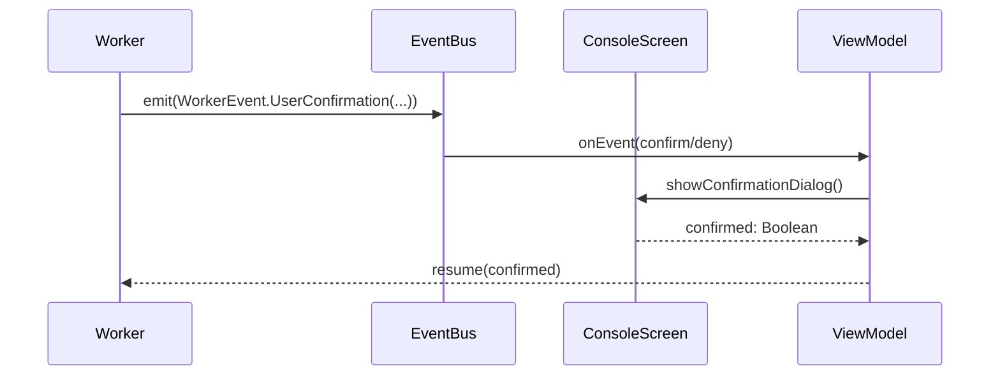

# Phase 5 & 6: Detailed Design

## Phase 5: AIAgent.process() using LlmExecutionRequest

### Current State

[`AIAgent.kt`](app/src/main/java/com/example/day/core/core_features/agent/domain/AIAgent.kt) contains:

```kotlin
interface AIAgent {
    suspend fun process(
        id: String,
        input: String,
        context: AContext,
        systemPrompt: String?,
        tools: List<ToolCallContext>,
        toolSettings: Map<String, String>,
        executor: LlmExecutor,
        config: AgentConfig
    ): AIAgentResult
}
```

This has **8 parameters** - messy and error-prone when calling.

### Solution: Use LlmExecutionRequest

[`LlmExecutionRequest.kt`](app/src/main/java/com/example/day/core/core_features/agent/domain/tools/LlmExecutionRequest.kt) already exists (lines 19-27):

```kotlin
data class LlmExecutionRequest(
    val initialHistory: List<ModelRequest.Message>,
    val memoryMessages: List<AContextMessage>,
    val prompt: AContextMessage,
    val systemPrompt: String?,
    val modelSettings: ModelSettings,
    val tools: List<ModelRequest.Tool>,
    val context: ToolCallContext
)
```

**Current state**: `ToolCallOrchestrator` has new `execute(LlmExecutionRequest)` ✅
**NOT done**: `AIAgent.process()` still calls 8-param deprecated version ❌

### Refactoring Steps

Current AIAgent.process() calls deprecated 8-param version (lines 56-68 in AIAgent.kt):

```kotlin
val result = orchestrator.execute(
    initialHistory = snapshot.messages.toModelRequestMessages(),
    memoryMessages = memoryMessages,
    prompt = enrichedPrompt,
    systemPrompt = config.systemPrompt,
    modelSettings = config.modelSettings,
    tools = tools,
    context = ToolCallContext(...),
    onEvent = onEvent
)
```

**Should become**:

```kotlin
val result = orchestrator.execute(
    LlmExecutionRequest(
        initialHistory = snapshot.messages.toModelRequestMessages(),
        memoryMessages = memoryMessages,
        prompt = enrichedPrompt,
        systemPrompt = config.systemPrompt,
        modelSettings = config.modelSettings,
        tools = tools,
        context = ToolCallContext(
            agentId = config.id,
            toolToServer = toolToServerMap
        )
    ),
    onEvent
)
```

This is a **simple refactor** — just wrap existing parameters in the data class. No logic changes.

### Benefits
- **Koog-consistent API**: Clean single-request pattern
- **Easier testing**: Mock single object instead of 8 parameters
- **Future-ready**: Easy to add streaming, retry logic, etc.

---

## Phase 6: User in the Loop UI (Future Work)

### Overview

Event-based architecture is already in place. Need UI layer to interact with [`WorkerEvent.UserConfirmation`](app/src/main/java/com/example/day/core/core_features/agent/domain/workers/base/WorkerEvent.kt).

### Architecture



### Components to Implement

1. **EventBus** (if not exists):
```kotlin
interface AgentEventBus {
    val events: Flow<WorkerEvent>
    suspend fun emit(event: WorkerEvent)
    suspend fun resume(event: WorkerEvent, confirmed: Boolean)
}
```

2. **ConsoleViewModel update**:
   - Subscribe to `AgentEventBus.events`
   - When `UserConfirmation` received → show dialog
   - On user response → call `resume()`

3. **ConsoleScreen UI**:
```kotlin
@Composable
fun ConsoleScreen(viewModel: ConsoleViewModel) {
    val uiState by viewModel.uiState.collectAsState()
    
    uiState.pendingConfirmation?.let { confirm ->
        AlertDialog(
            onConfirm = { viewModel.confirm(confirm.id, true) },
            onDeny = { viewModel.confirm(confirm.id, false) },
            title = confirm.title,
            message = confirm.message
        )
    }
    
    // ... rest of screen
}
```

### Example UserConfirmation events

From TaskWorker/VerificationStateHandler:
- "Approve this plan?"
- "Continue with execution?"
- "Accept this result?"

### Priority

**Low** - current system works without UI confirmation. Only needed if:
- Dangerous tool calls (delete, write files)
- Expensive operations (API calls with cost)
- User wants control over agent decisions

---

## Summary

| Phase | Effort | Value | Status |
|-------|--------|-------|--------|
| 5: AIAgent.process() → LlmExecutionRequest | Medium | High - cleaner API | Recommended |
| 6: User in Loop UI | High | Medium - nice to have | Future Work |
