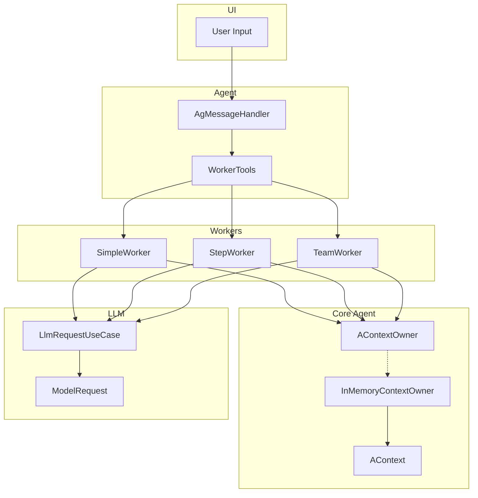
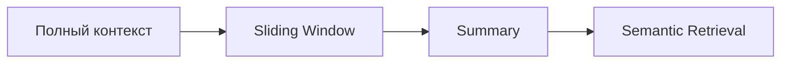

# Архитектурный анализ: Agent с Context Management

## 1. Обзор текущей архитектуры

### Имеющиеся компоненты

| Компонент | Назначение | Статус |
|-----------|------------|--------|
| [`AContext`](app/src/main/java/com/example/day/core/core_features/agent/domain/model/AContext.kt) | Модель контекста агента | Создан, не используется |
| [`AContextMessage`](app/src/main/java/com/example/day/core/core_features/agent/domain/model/AContextMessage.kt) | Сообщение в контексте | Создан, не используется |
| [`AContextOwner`](app/src/main/java/com/example/day/core/core_features/agent/domain/model/AContextOwner.kt) | Интерфейс управления контекстом | Только интерфейс |
| [`Role`](app/src/main/java/com/example/day/core/core_features/agent/domain/model/Role.kt) | Роли: SYSTEM, USER, ASSISTANT | Создан, не используется |
| [`AWorker`](app/src/main/java/com/example/day/features/console/impl/domain/agents/worker/base/AWorker.kt) | Базовый интерфейс агента | Используется |
| [`SimpleWorker`](app/src/main/java/com/example/day/features/console/impl/domain/agents/worker/SimpleWorker.kt) | Простой одноразовый запрос | Работает |
| [`PromptWorker`](app/src/main/java/com/example/day/features/console/impl/domain/agents/worker/PromptWorker.kt) | Двухэтапный агент | Работает |
| [`StepWorker`](app/src/main/java/com/example/day/features/console/impl/domain/agents/worker/StepWorker.kt) | Многошаговый агент | Работает |
| [`TeamWorker`](app/src/main/java/com/example/day/features/console/impl/domain/agents/worker/TeamWorker.kt) | Командный агент | Работает |

### Как работает текущая система

```
User → ChatCommand → AgMessageHandler → AWorker → LlmRequestUseCase → LLM API
                            ↓
                      WorkerEvent (Speech, RequestStart, etc.)
```

---

## 2. Выявленные проблемы

### Проблема 1: AContext не интегрирован
- **Описание**: Модели [`AContext`](app/src/main/java/com/example/day/core/core_features/agent/domain/model/AContext.kt) и [`AContextMessage`](app/src/main/java/com/example/day/core/core_features/agent/domain/model/AContextMessage.kt) созданы, но **не используются** ни одним из Workers
- **Влияние**: Нет централизованного управления контекстом
- **Решение**: Интегрировать AContext в AWorker

### Проблема 2: Локальное хранение истории в каждом Worker
```kotlin
// Текущее состояние в SimpleWorker, StepWorker, TeamWorker
val messageHistory = mutableListOf<ModelRequest.Message>()
```
- **Описание**: Каждый Worker хранит историю сообщений локально в `mutableListOf`
- **Влияние**: 
  - Нет возможности переиспользовать контекст между вызовами
  - Нет разделения между агентами
  - Контекст теряется при пересоздании Worker
- **Решение**: Использовать AContextOwner для централизованного хранения

### Проблема 3: Дублирование Role enum
- **Описание**: Существует два enum Role:
  - [`agent/domain/model/Role`](app/src/main/java/com/example/day/core/core_features/agent/domain/model/Role.kt): `SYSTEM, USER, ASSISTANT`
  - [`llm/domain/model/ModelRequest.Role`](app/src/main/java/com/example/day/core/core_features/llm/domain/model/ModelRequest.kt): `System, Assistant, User`
- **Влияние**: Путаница, необходимость маппинга
- **Решение**: Использовать единый enum из agent model

### Проблема 4: AWorker зависит от ChatSettings
```kotlin
// Текущая сигнатура
suspend fun doWork(task: String, chatSettings: ChatSettings): Flow<WorkerEvent>
```
- **Описание**: Агент привязан к конкретному чату через ChatSettings
- **Влияние**: Невозможно переиспользовать агента без привязки к чату
- **Решение**: Разделить на ModelSettings (для LLM) и AContext (для состояния)

---

## 3. План реализации MVP

### Этап 1: Инфраструктура (базовые компоненты)

#### 1.1 Создать InMemoryContextOwner
```
Location: core/core_features/agent/domain/
File: InMemoryContextOwner.kt

Responsibilities:
- Хранит Map<String, AContext> в памяти (agentName → context)
- Реализует интерфейс AContextOwner
- Предоставляет методы: getContext(), saveContext(), clearContext()
```

#### 1.2 Создать маппер между моделями
```
Location: core/core_features/agent/domain/
File: AgentMapper.kt

Responsibilities:
- Конвертация AContextMessage ↔ ModelRequest.Message
- Конвертация Role (agent.model.Role → llm.model.Role)
```

#### 1.3 Расширить AWorker для поддержки контекста
```
Location: features/console/impl/domain/agents/worker/base/
File: AWorker.kt (модификация)

Добавить:
- agentName: String
- contextOwner: AContextOwner
- Методы: getContext(), saveMessage()

Новая сигнатура:
suspend fun doWork(
    task: String,
    modelSettings: ModelSettings,
    agentName: String
): Flow<WorkerEvent>
```

### Этап 2: Рефакторинг существующих Workers

#### 2.1 Создать базовый абстрактный класс AgentCore
```
Location: features/console/impl/domain/agents/worker/base/
File: AgentCore.kt

Responsibilities:
- Инкапсулирует логику работы с контекстом
- Предоставляет: addUserMessage(), addAssistantMessage(), getHistory()
- Управляет orderNumber для сообщений
```

#### 2.2 Модифицировать SimpleWorker
- Наследовать от AgentCore
- Использовать AContextOwner для хранения истории
- Передавать ModelSettings вместо ChatSettings

#### 2.3 Аналогично модифицировать StepWorker, TeamWorker, PromptWorker

### Этап 3: WorkerTools интеграция

#### 3.1 Обновить WorkerTools
```
Location: features/console/impl/domain/agents/
File: WorkerTools.kt

Добавить:
- sendMessage(chatId: Long, role: Role, content: String)
- Получать agentName и использовать его для контекста
```

---

## 4. Архитектура для MVP (диаграмма)



---

## 5. План для будущего расширения (v2)

### 5.1 Стратегии управления памятью



| Стратегия | Описание | Когда использовать |
|-----------|----------|-------------------|
| **Full** | Хранить всю историю | Короткие диалоги, важна точность |
| **Sliding Window** | Хранить последние N сообщений | Ограниченный token budget |
| **Summary** | Периодически суммаризировать историю | Длинные диалоги |
| **Semantic Retrieval** | Векторный поиск по истории | Большие базы знаний |

**Интерфейс:**
```kotlin
interface MemoryStrategy {
    fun trimContext(context: AContext, maxTokens: Int): AContext
}
```

### 5.2 Привязка к чату

```
Location: core/core_features/agent/domain/
File: ChatContextOwner.kt

Responsibilities:
- Хранит Map<chatId, Map<agentName, AContext>>
- Связывает контекст с конкретным чатом
- Методы: getContext(chatId, agentName), saveContext(chatId, context)
```

### 5.3 Персистентность

- SQLite/Room для долгосрочного хранения
- File-based storage для кэша
- Sync between in-memory and persistent storage

### 5.4 Расширенные возможности

| Функция | Описание |
|---------|----------|
| **System Prompt Templates** | Шаблоны system prompts для разных типов агентов |
| **Tool Calling** | Инструменты для агента (калькулятор, поиск, etc.) |
| **Multi-agent** | Взаимодействие нескольких агентов |
| **Agent Factory** | Фабрика для создания агентов с разными конфигурациями |

---

## 6. Детали реализации (без кода)

### 6.1 InMemoryContextOwner

```
- Map<String, AContext> contexts = {}
- getContext(agentName): AContext
  → Если不存在, создать новый с пустым списком сообщений
- saveContext(context): Unit
  → contexts[context.agentName] = context
- clearContext(agentName): Unit
  → contexts.remove(agentName)
```

### 6.2 AgentCore базовая логика

```
- getHistory(): List<ModelRequest.Message>
  → Конвертировать AContext.messages через маппер
- addUserMessage(content): Unit
  → Добавить в AContext с role=USER, orderNumber++
- addAssistantMessage(content): Unit
  → Добавить в AContext с role=ASSISTANT, orderNumber++
- getSystemPrompt(): String
  → Вернуть AContext.systemPrompt
```

### 6.3 Интеграция с WorkerTools

```
- При отправке сообщения в чат:
  1. Сохранить сообщение в AContext (addUserMessage/addAssistantMessage)
  2. Отправить в чат через WorkerTools
- При получении ответа от LLM:
  1. Сохранить ответ в AContext
  2. Отправить в чат через WorkerTools
```

---

## 7. Резюме

### Для MVP (текущее задание)
1. ✅ Создать InMemoryContextOwner
2. ✅ Создать маппер AgentMapper
3. ✅ Расширить AWorker для поддержки AContextOwner
4. ✅ Создать AgentCore базовый класс
5. ✅ Рефакторить SimpleWorker на использование контекста

### Для v2 (будущее)
1. Стратегии управления памятью (Sliding Window, Summary)
2. Привязка к чату (ChatContextOwner)
3. Персистентность контекста
4. Tool Calling
5. Multi-agent системы

---

*План создан для курса "AI для Android программистов", задание 2*
*Тема: Context management, Memory management, building agentic flow*
