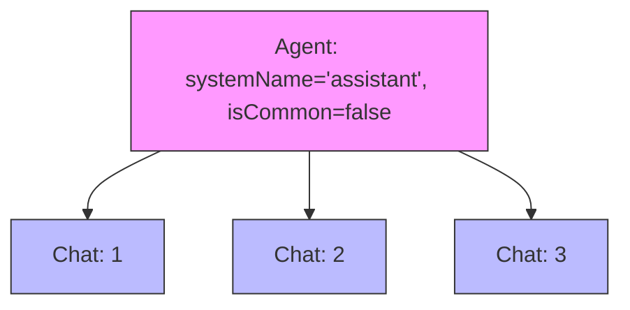
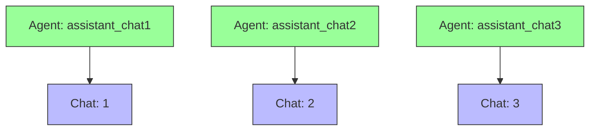
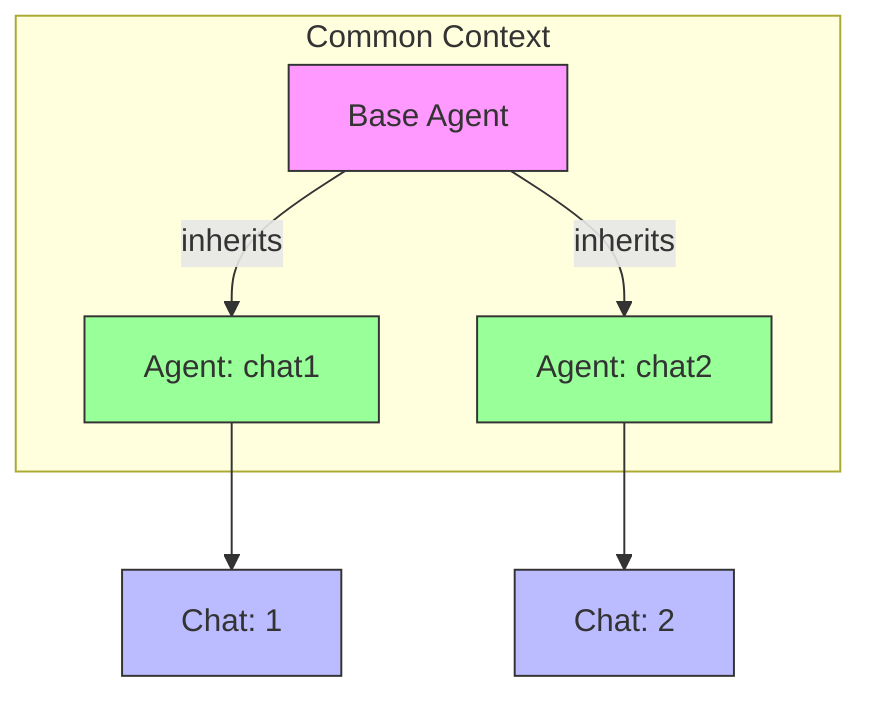

# План: Изменение логики создания агентов с учетом привязки к чату

## Анализ текущей реализации

### Проблема
В текущей реализации ([`AgentRepositoryImpl.getOrCreateAgent`](app/src/main/java/com/example/day/core/core_features/agent/data/AgentRepositoryImpl.kt:132)):

1. Поиск агента выполняется только по `systemName + isCommon` (строки 139-140)
2. При `isCommon = false` найденный агент может быть привязан к **любому** чату
3. Это игнорирует фактический чат, из которого начат диалог

```kotlin
// Текущая логика (строки 139-150)
val existingAgent = agentDao.getBySystemNameAndIsCommon(systemName, isCommonInt)
if (existingAgent != null) {
    val agent = agentMapper.toDomain(existingAgent)
    // ПРОБЛЕМА: не проверяется конкретный chatId
    if (!isCommon && !agentToChatDao.isAgentBoundToChat(agent.id, chatId)) {
        bindAgentToChat(agent.id, chatId)  // Просто добавляем привязку
    }
    return agent
}
```

### Результат
- Пользователь начинает диалог с агентом в чате A
- Система находит агента, привязанного к чату B
- Агент из чата B используется в чате A (контекст перемешивается)

---

## Требуемое поведение

| Параметр | Поведение |
|----------|-----------|
| `isCommon = true` | Искать агента только по `systemName` (общий агент) |
| `isCommon = false` | Искать агента по `systemName + chatId` (чат-специфичный агент) |

---

## Детальный план реализации

### Этап 1: Изменение DAO слоя

#### 1.1 Добавить новый метод в AgentDao
**Файл**: [`app/src/main/java/com/example/day/core/core_features/agent/data/local/dao/AgentDao.kt`](app/src/main/java/com/example/day/core/core_features/agent/data/local/dao/AgentDao.kt)

```kotlin
/**
 * Get common agent by system name only.
 * Used when isCommon = true
 */
@Query("SELECT * FROM agents WHERE system_name = :systemName AND is_common = 1 LIMIT 1")
suspend fun getCommonAgentBySystemName(systemName: String): AgentEntity?
```

#### 1.2 Добавить метод поиска в AgentToChatDao  
**Файл**: [`app/src/main/java/com/example/day/core/core_features/agent/data/local/dao/AgentToChatDao.kt`](app/src/main/java/com/example/day/core/core_features/agent/data/local/dao/AgentToChatDao.kt)

```kotlin
/**
 * Find agent bound to a specific chat by system name.
 * Used when isCommon = false to find chat-specific agent.
 */
@Query("""
    SELECT a.* FROM agents a
    INNER JOIN agent_to_chat atc ON a.id = atc.agent_id
    WHERE a.system_name = :systemName 
    AND a.is_common = 0 
    AND atc.chat_id = :chatId
    LIMIT 1
""")
suspend fun getAgentBySystemNameAndChatId(systemName: String, chatId: Long): AgentEntity?
```

### Этап 2: Изменение Repository слоя

#### 2.1 Обновить AgentRepository
**Файл**: [`app/src/main/java/com/example/day/core/core_features/agent/domain/AgentRepository.kt`](app/src/main/java/com/example/day/core/core_features/agent/domain/AgentRepository.kt:97)

Обновить документацию метода `getOrCreateAgent`:

```kotlin
/**
 * Get or create agent with new logic:
 * 
 * If isCommon = true:
 *   1. Find agent by systemName only (common agents)
 *   2. If not found - create new common agent
 * 
 * If isCommon = false:
 *   1. Find agent by systemName + chatId (chat-specific)
 *   2. If not found - create new agent and bind to chatId
 */
suspend fun getOrCreateAgent(
    systemName: String,
    isCommon: Boolean,
    chatId: Long
): Agent
```

#### 2.2 Обновить AgentRepositoryImpl
**Файл**: [`app/src/main/java/com/example/day/core/core_features/agent/data/AgentRepositoryImpl.kt`](app/src/main/java/com/example/day/core/core_features/agent/data/AgentRepositoryImpl.kt:132)

```kotlin
override suspend fun getOrCreateAgent(
    systemName: String,
    isCommon: Boolean,
    chatId: Long
): Agent {
    return if (isCommon) {
        // ЛОГИКА 1: Общие агенты (isCommon = true)
        getOrCreateCommonAgent(systemName)
    } else {
        // ЛОГИКА 2: Чат-специфичные агенты (isCommon = false)
        getOrCreateChatSpecificAgent(systemName, chatId)
    }
}

private suspend fun getOrCreateCommonAgent(systemName: String): Agent {
    // 1. Искать только по systemName (isCommon = 1)
    val existingAgent = agentDao.getCommonAgentBySystemName(systemName)
    if (existingAgent != null) {
        return agentMapper.toDomain(existingAgent)
    }
    
    // 2. Создать нового общего агента
    val botUser = chatRepository.getOrCreateDefaultUsers().second
    val newAgentId = createAgent(
        systemName = systemName,
        title = systemName,
        chatUserId = botUser.id,
        isCommon = true
    )
    
    return getAgentById(newAgentId) ?: throw IllegalStateException("Failed to create common agent")
}

private suspend fun getOrCreateChatSpecificAgent(systemName: String, chatId: Long): Agent {
    // 1. Искать агента по systemName + chatId
    val existingAgent = agentToChatDao.getAgentBySystemNameAndChatId(systemName, chatId)
    if (existingAgent != null) {
        return agentMapper.toDomain(existingAgent)
    }
    
    // 2. Создать нового чат-специфичного агента
    val botUser = chatRepository.getOrCreateDefaultUsers().second
    val newAgentId = createAgent(
        systemName = systemName,
        title = systemName,
        chatUserId = botUser.id,
        isCommon = false
    )
    
    // 3. Обязательно привязать к чату
    bindAgentToChat(newAgentId, chatId)
    
    return getAgentById(newAgentId) ?: throw IllegalStateException("Failed to create chat-specific agent")
}
```

### Этап 3: Тестирование

- [ ] Unit-тесты для `getOrCreateCommonAgent`
- [ ] Unit-тесты для `getOrCreateChatSpecificAgent`  
- [ ] Интеграционный тест сценария: создание агента в разных чатах

---

## Альтернативные подходы для привязки агентов к чатам

### Подход А: Один агент → Множество чатов (текущий, но исправленный)



**Плюсы**: Один агент, меньше данных
**Минусы**: Общий контекст между чатами (может быть нежелательно)

### Подход Б: Один агент → Один чат (рекомендуемый для isCommon=false)



**Плюсы**: Изолированный контекст для каждого чата
**Минусы**: Больше агентов в БД

### Подход В: Гибридный с общим контекстом



**Описание**: Базовый агент хранит общий контекст, чат-специфичные агенты наследуют и расширяют
**Плюсы**: Гибкость
**Минусы**: Сложность реализации

---

## Рекомендация

**Рекомендую Подход Б** (один агент → один чат) по следующим причинам:

1. **Изоляция контекста**: Каждый чат имеет независимый разговор с агентом
2. **Предсказуемость**: Поведение агента не зависит от других чатов
3. **Простота отладки**: Легко понять, какой агент используется в конкретном чате
4. **Безопасность**: Данные не перемешиваются между чатами

План выше реализует именно Подход Б.

---

## Файлы для изменения

| Файл | Тип изменений |
|------|---------------|
| [`AgentDao.kt`](app/src/main/java/com/example/day/core/core_features/agent/data/local/dao/AgentDao.kt) | Добавить метод `getCommonAgentBySystemName` |
| [`AgentToChatDao.kt`](app/src/main/java/com/example/day/core/core_features/agent/data/local/dao/AgentToChatDao.kt) | Добавить метод `getAgentBySystemNameAndChatId` |
| [`AgentRepository.kt`](app/src/main/java/com/example/day/core/core_features/agent/domain/AgentRepository.kt) | Обновить документацию |
| [`AgentRepositoryImpl.kt`](app/src/main/java/com/example/day/core/core_features/agent/data/AgentRepositoryImpl.kt) | Изменить логику `getOrCreateAgent` |

---

## Резюме

| Задача | Описание |
|--------|----------|
| Цель | Изменить логику создания агентов: для `isCommon=false` искать по trio (systemName, isCommon, chatId) |
| Изменение | Добавить 2 новых DAO метода, обновить RepositoryImpl |
| Результат | Каждый чат получает своего изолированного агента при isCommon=false |
