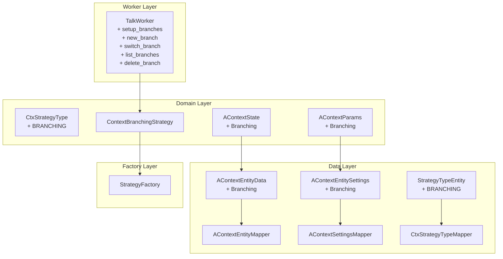

# План разработки: Branching Strategy (Ветвление)

## Описание задачи

Добавить новый тип стратегии управления контекстом "Branching" (Ветвление) в AI-чат приложение.

### Концепция

**Branching** — это стратегия, позволяющая создавать независимые ветки диалога от одной точки (checkpoint), аналогично Git. Каждая ветка хранит свою историю сообщений, переключение между ветками позволяет тестировать разные сценарии развития диалога.

**Особенности:**
- Хранение нескольких веток (Map<branchId, List<messages>>)
- Текущая активная ветка (currentBranchId)
- Создание новой ветки как копии текущей (checkpoint)
- Переключение между ветками без потери истории
- Каждая ветка независима — сообщения добавляются только в активную ветку

### Команды активации и управления

```
# Переключение на Branching стратегию
@@talk(setup_branches --main main)
# --main branchId - опциональный параметр для имени основной ветки (default: "main")

# Создание новой ветки от текущей
@@talk(new_branch --id branchId)

# Переключение на существующую ветку
@@talk(switch_branch --id branchId)

# Просмотр списка всех веток
@@talk(list_branches)

# Удаление ветки
@@talk(delete_branch --id branchId)
```

---

## Архитектура изменений



---

## Последовательность изменений

### Phase 1: Domain Model Extensions

#### 1. CtxStrategyType.kt
**Файл**: `app/src/main/java/com/example/day/core/core_features/agent/domain/strategy/CtxStrategyType.kt`

Добавить enum value:
```kotlin
/**
 * Стратегия ветвления - позволяет создавать независимые ветки диалога.
 * Каждая ветка хранит свою историю сообщений.
 */
BRANCHING
```

#### 2. AContext.kt
**Файл**: `app/src/main/java/com/example/day/core/core_features/agent/domain/model/AContext.kt`

Добавить в `AContextState`:
```kotlin
/**
 * Branching state - хранит Map веток и ID текущей активной ветки.
 * @param branches Map: branchId -> список сообщений ветки
 * @param currentBranchId ID активной ветки
 * @param defaultBranchId ID ветки по умолчанию (основной ветки)
 */
data class Branching(
    val branches: PersistentMap<String, PersistentList<AContextMessage>>,
    val currentBranchId: String,
    val defaultBranchId: String
) : AContextState
```

Добавить в `AContextParams`:
```kotlin
/**
 * Branching params - параметры стратегии ветвления.
 * @param defaultBranchId имя основной ветки по умолчанию
 */
data class Branching(
    val defaultBranchId: String = "main"
) : AContextParams
```

---

### Phase 2: Data Layer Extensions

#### 3. AContextEntityData.kt
**Файл**: `app/src/main/java/com/example/day/core/core_features/agent/data/local/model/AContextEntityData.kt`

Добавить serializable класс:
```kotlin
/** состояние стратегии ветвления - хранит Map веток и ID текущей ветки */
@Serializable
data class Branching(
    val branches: Map<String, List<AContextMessageEntityData>>,
    val currentBranchId: String,
    val defaultBranchId: String
) : AContextEntityData
```

#### 4. AContextEntitySettings.kt (внутри AContextEntityData.kt)
**Файл**: `app/src/main/java/com/example/day/core/core_features/agent/data/local/model/AContextEntityData.kt`

Добавить serializable класс:
```kotlin
/** параметры стратегии ветвления */
@Serializable
data class Branching(
    val defaultBranchId: String
) : AContextEntitySettings
```

#### 5. AContextEntityMapper.kt
**Файл**: `app/src/main/java/com/example/day/core/core_features/agent/data/local/mapper/AContextEntityMapper.kt`

Добавить mapping в `toEntityData()`:
```kotlin
is AContextState.Branching -> Branching(
    branches = context.branches.mapValues { (_, messages) ->
        messages.map { toEntityData(it) }
    },
    currentBranchId = context.currentBranchId,
    defaultBranchId = context.defaultBranchId
)
```

Добавить mapping в `toDomain()`:
```kotlin
is Branching -> AContextState.Branching(
    branches = entityData.branches.mapValues { (_, messages) ->
        messages.map { toDomain(it) }.toPersistentList()
    }.toPersistentMap(),
    currentBranchId = entityData.currentBranchId,
    defaultBranchId = entityData.defaultBranchId
)
```

#### 6. AContextSettingsMapper.kt
**Файл**: `app/src/main/java/com/example/day/core/core_features/agent/data/local/mapper/AContextSettingsMapper.kt`

Добавить mapping в `toEntityData()`:
```kotlin
is AContextParams.Branching -> Branching(
    defaultBranchId = context.defaultBranchId
)
```

Добавить mapping в `toDomain()`:
```kotlin
is Branching -> AContextParams.Branching(
    defaultBranchId = entityData.defaultBranchId
)
```

Добавить import и case в `jsonToContext()` и `contextToJson()` (работают через полиморфизм sealed interface).

#### 7. StrategyTypeEntity.kt
**Файл**: `app/src/main/java/com/example/day/core/core_features/agent/data/local/model/StrategyTypeEntity.kt`

Добавить enum value:
```kotlin
/**
 * Стратегия ветвления - позволяет создавать независимые ветки диалога.
 */
BRANCHING
```

#### 8. CtxStrategyTypeMapper.kt
**Файл**: `app/src/main/java/com/example/day/core/core_features/agent/data/local/mapper/CtxStrategyTypeMapper.kt`

Добавить mapping в `toDomain()`:
```kotlin
StrategyTypeEntity.BRANCHING -> CtxStrategyType.BRANCHING
```

Добавить mapping в `toEntity()`:
```kotlin
CtxStrategyType.BRANCHING -> StrategyTypeEntity.BRANCHING
```

---

### Phase 3: Strategy Implementation

#### 9. ContextBranchingStrategy.kt
**Файл**: `app/src/main/java/com/example/day/core/core_features/agent/domain/strategy/impl/ContextBranchingStrategy.kt`

**Класс**: Реализует `ContextStrategy`

**Зависимости**: Нет внешних зависимостей (не требует LLM)

**Структура состояния:**
- `branches: PersistentMap<String, PersistentList<AContextMessage>>` - Map всех веток
- `currentBranchId: String` - ID активной ветки
- `defaultBranchId: String` - ID основной ветки

**Методы:**

##### process()
1. Получает текущее состояние (`AContextState.Branching`)
2. Берет сообщения из активной ветки: `branches[currentBranchId]`
3. Возвращает `ContextSnapshot` с сообщениями активной ветки + новый user prompt

##### afterResponse()
1. Получает текущее состояние
2. Добавляет user prompt и assistant response в активную ветку
3. Сохраняет обновленное состояние
4. Возвращает `ContextStrategyResult` с информацией о текущей ветке

##### getInfoReport()
Возвращает:
```
Стратегия: branching (ветвление)
Основная ветка: [defaultBranchId]
Текущая ветка: [currentBranchId]
Всего веток: [N]
Сообщений в текущей ветке: [M]
```

##### getFullContextReport()
Возвращает полный список всех веток с количеством сообщений и содержимым текущей ветки:
```
=== Агент: [systemName] ===
Системный промпт: [systemPrompt]

=== Ветки диалога ===
- [branchId1]: [count1] сообщений [текущая]
- [branchId2]: [count2] сообщений
...

=== Сообщения в текущей ветке [currentBranchId] ===
[role]: [content]
...
```

##### updateParams()
Обновляет `defaultBranchId` из map параметров.

##### createBranch()
Специфичный метод для создания новой ветки:
1. Копирует текущие сообщения активной ветки
2. Создает новую ветку с этими сообщениями
3. Переключается на новую ветку (делает её активной)
4. Сохраняет состояние

##### switchBranch()
Специфичный метод для переключения ветки:
1. Проверяет существование ветки в Map
2. Если существует - обновляет `currentBranchId`
3. Если не существует - возвращает false (для показа ошибки)

##### deleteBranch()
Специфичный метод для удаления ветки:
1. Проверяет что ветка существует
2. Проверяет что удаляемая ветка не текущая активная
3. Удаляет ветку из Map
4. Переключается на defaultBranchId если удалили текущую

##### listBranches()
Возвращает список всех веток с отметкой текущей.

---

### Phase 4: Factory Registration

#### 10. StrategyFactory.kt
**Файл**: `app/src/main/java/com/example/day/core/core_features/agent/domain/strategy/StrategyFactory.kt`

Добавить case в `create(type: CtxStrategyType)`:
```kotlin
CtxStrategyType.BRANCHING -> ContextBranchingStrategy()
```

Добавить case в `create(aContext: AContextParams)`:
```kotlin
is AContextParams.Branching -> ContextBranchingStrategy()
```

---

### Phase 5: Worker Layer Extensions

#### 11. ContextStrategyConstants.kt
**Файл**: `app/src/main/java/com/example/day/core/core_features/agent/domain/strategy/ContextStrategyConstants.kt`

Добавить константу для имени основной ветки:
```kotlin
/**
 * Parameter name for default/main branch ID.
 * Used in BranchingStrategy to set the default branch name.
 */
const val PARAM_DEFAULT_BRANCH = "main"
```

#### 12. TalkWorker.kt
**Файл**: `app/src/main/java/com/example/day/core/core_features/agent/domain/workers/TalkWorker.kt`

**Изменения:**

1. Добавить константы команд:
```kotlin
private const val SETUP_BRANCHES = "setup_branches"
private const val NEW_BRANCH = "new_branch"
private const val SWITCH_BRANCH = "switch_branch"
private const val LIST_BRANCHES = "list_branches"
private const val DELETE_BRANCH = "delete_branch"

private val REGISTERED_COMMANDS = setOf(
    INFO, CONTEXT, SETUP, SETUP_SLIDING, SETUP_STICKY,
    SETUP_BRANCHES, NEW_BRANCH, SWITCH_BRANCH, LIST_BRANCHES, DELETE_BRANCH
)
```

2. Добавить case в `processCommand()`:
```kotlin
SETUP_BRANCHES -> executeSetupBranchesCommand(command.parameters, chat)
NEW_BRANCH -> executeNewBranchCommand(command.parameters, chat)
SWITCH_BRANCH -> executeSwitchBranchCommand(command.parameters, chat)
LIST_BRANCHES -> executeListBranchesCommand(chat)
DELETE_BRANCH -> executeDeleteBranchCommand(command.parameters, chat)
```

3. Реализовать методы:

##### executeSetupBranchesCommand()
- Парсит параметр `--main` (default: "main")
- Если текущая стратегия уже BRANCHING — обновляет defaultBranchId
- Иначе мигрирует сообщения из текущей стратегии в новую BRANCHING:
  - Создает Map с одной веткой (main)
  - Копирует текущие сообщения в эту ветку
  - Устанавливает currentBranchId = main
  - Устанавливает defaultBranchId = main (или из параметра)

##### executeNewBranchCommand()
- Парсит параметр `--id branchId`
- Получает агента и проверяет что стратегия BRANCHING
- Вызывает `ContextBranchingStrategy.createBranch()`
- Отправляет подтверждение в чат

##### executeSwitchBranchCommand()
- Парсит параметр `--id branchId`
- Получает агента и проверяет что стратегия BRANCHING
- Вызывает `ContextBranchingStrategy.switchBranch()`
- Если ветка не существует — отправляет "ветки [id] не существует"
- Если успешно — отправляет подтверждение

##### executeListBranchesCommand()
- Получает агента и проверяет что стратегия BRANCHING
- Вызывает `ContextBranchingStrategy.listBranches()`
- Отправляет список веток в чат

##### executeDeleteBranchCommand()
- Парсит параметр `--id branchId`
- Получает агента и проверяет что стратегия BRANCHING
- Вызывает `ContextBranchingStrategy.deleteBranch()`
- Отправляет подтверждение или ошибку в чат

4. Обновить `extractMessagesFromCurrentStrategy()`:
```kotlin
is AContextState.Branching -> state.branches[state.currentBranchId] ?: emptyList()
```

---

### Phase 6: Import Extensions

#### 13. AContextExt.kt
**Файл**: `app/src/main/java/com/example/day/core/core_features/agent/domain/model/AContextExt.kt`

Добавить extension функции для работы с Branching:
```kotlin
/**
 * Добавить сообщение пользователя в указанную ветку Branching стратегии.
 */
fun AContextState.Branching.addUserMessageToBranch(
    branchId: String, 
    content: String
): AContextState.Branching

/**
 * Добавить сообщение ассистента в указанную ветку Branching стратегии.
 */
fun AContextState.Branching.addAssistantMessageToBranch(
    branchId: String, 
    content: String
): AContextState.Branching
```

---

## Пример использования

### Сценарий 1: Базовое использование
```
User: @@talk(setup_branches)
Bot: Стратегия переключена на Branching. Основная ветка: main. Мигрировано сообщений: 0

User: Привет, расскажи о Kotlin
Bot: [ответ о Kotlin]

User: @@talk(new_branch --id experiments)
Bot: Создана новая ветка "experiments" от "main". Переключено на новую ветку.

User: А теперь расскажи о Java
Bot: [ответ о Java]

User: @@talk(switch_branch --id main)
Bot: Переключено на ветку "main"

User: Что мы обсуждали?
Bot: [вспоминает только про Kotlin - из ветки main]
```

### Сценарий 2: Просмотр и управление ветками
```
User: @@talk(list_branches)
Bot: Ветки диалога:
      - main: 2 сообщений [основная]
      - experiments: 2 сообщений [текущая]

User: @@talk(delete_branch --id experiments)
Bot: Ветка "experiments" удалена. Переключено на основную ветку "main".
```

### Сценарий 3: Настройка с кастомным именем основной ветки
```
User: @@talk(setup_branches --main trunk)
Bot: Стратегия переключена на Branching. Основная ветка: trunk.
```

---

## Тестирование

### Unit Tests
1. **ContextBranchingStrategyTest**
   - process() возвращает сообщения из активной ветки
   - afterResponse() добавляет сообщения только в активную ветку
   - createBranch() создает копию текущей ветки
   - switchBranch() переключает на существующую ветку
   - switchBranch() возвращает false для несуществующей ветки
   - deleteBranch() удаляет ветку
   - deleteBranch() не удаляет активную ветку
   - getInfoReport() показывает правильную статистику
   - getFullContextReport() показывает все ветки

### Integration Tests
1. **TalkWorkerBranchingTest**
   - setup_branches переключает стратегию
   - new_branch создает ветку
   - switch_branch переключает ветку
   - list_branches показывает список
   - delete_branch удаляет ветку

---

## Файлы для изменения

| # | Файл | Тип изменения |
|---|------|---------------|
| 1 | `CtxStrategyType.kt` | Добавить enum value |
| 2 | `AContext.kt` | Добавить data class в sealed interface |
| 3 | `AContextEntityData.kt` | Добавить serializable data class |
| 4 | `AContextEntityMapper.kt` | Добавить mapping cases |
| 5 | `AContextSettingsMapper.kt` | Добавить mapping cases |
| 6 | `StrategyTypeEntity.kt` | Добавить enum value |
| 7 | `CtxStrategyTypeMapper.kt` | Добавить mapping cases |
| 8 | `ContextBranchingStrategy.kt` | Создать новый файл |
| 9 | `StrategyFactory.kt` | Добавить factory cases |
| 10 | `ContextStrategyConstants.kt` | Добавить константу |
| 11 | `TalkWorker.kt` | Добавить команды и обработчики |
| 12 | `AContextExt.kt` | Добавить extension functions (опционально) |

---

## Примечания

1. **Персистентность**: Используем `PersistentMap` и `PersistentList` из kotlinx.collections.immutable для неизменяемых коллекций
2. **Сериализация**: Для Room используем Kotlinx Serialization с JSON
3. **Ошибки**: При переключении на несуществующую ветку показываем "ветки [id] не существует"
4. **Удаление**: Нельзя удалить активную ветку — сначала нужно переключиться на другую
5. **Миграция**: При переключении с другой стратегии на BRANCHING — текущие сообщения переходят в основную ветку
