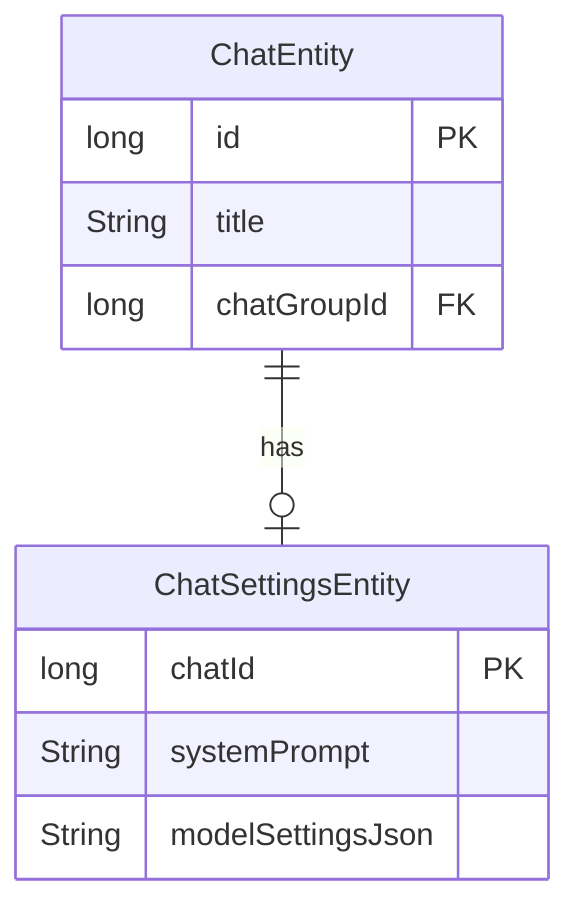

# План: Интеграция ChatSettings в Chat

## Цель
Добавить связь между `Chat` и `ChatSettings` так, чтобы каждый чат имел свои настройки. ChatSettings сохраняется в отдельной таблице БД.

## Архитектура



## Изменения

### 1. Domain Layer - Модели

#### 1.1 Обновить [`Chat.kt`](app/src/main/java/com/example/day/core/core_features/chat/domain/model/Chat.kt)
```kotlin
data class Chat(
    val id: Long,
    val title: String,
    val chatGroup: ChatGroup,
    val settings: ChatSettings  // Добавить поле
)
```

#### 1.2 ChatSettings и ModelSettings - остаются без изменений
Domain-модели остаются чистыми, без аннотаций сериализации

### 2. Data Layer - Entity

#### 2.1 Создать `ModelSettingsEntity.kt` (сериализуемая модель для JSON)
```kotlin
@Serializable
internal data class ModelSettingsEntity(
    val name: String,
    val stopSequence: List<String> = emptyList(),
    val maxTokens: Int = 0,
    val jsonFormat: Boolean = false,
    val temperature: Double? = null,
    val reasoningEffort: String? = null
)
```

#### 2.2 Создать `ChatSettingsEntity.kt`
```kotlin
@Entity(
    tableName = "chat_settings",
    primaryKeys = ["chat_id"],
    foreignKeys = [
        ForeignKey(
            entity = ChatEntity::class,
            parentColumns = ["id"],
            childColumns = ["chat_id"],
            onDelete = ForeignKey.CASCADE
        )
    ]
)
internal data class ChatSettingsEntity(
    @ColumnInfo(name = "chat_id")
    val chatId: Long,
    
    @ColumnInfo(name = "system_prompt")
    val systemPrompt: String,
    
    @ColumnInfo(name = "model_settings_json")
    val modelSettingsJson: String  // JSON от kotlinx.serialization
)
```

### 3. Data Layer - DAO

#### 3.1 Создать `ChatSettingsDao.kt`
```kotlin
@Dao
internal interface ChatSettingsDao {
    @Insert(onConflict = OnConflictStrategy.REPLACE)
    suspend fun insert(settings: ChatSettingsEntity)
    
    @Query("SELECT * FROM chat_settings WHERE chat_id = :chatId")
    suspend fun getSettingsByChatId(chatId: Long): ChatSettingsEntity?
    
    @Query("DELETE FROM chat_settings WHERE chat_id = :chatId")
    suspend fun deleteByChatId(chatId: Long)
    
    @Update
    suspend fun update(settings: ChatSettingsEntity)
}
```

### 4. Data Layer - Mappers

#### 4.1 Создать `ModelSettingsMapper.kt`
```kotlin
internal class ModelSettingsMapper @Inject constructor() {
    private val json = Json { ignoreUnknownKeys = true }
    
    fun toDomain(entity: ModelSettingsEntity): ModelSettings {
        return ModelSettings(
            name = entity.name,
            stopSequence = entity.stopSequence.toImmutableList(),
            maxTokens = entity.maxTokens,
            jsonFormat = entity.jsonFormat,
            temperature = entity.temperature,
            reasoningEffort = entity.reasoningEffort
        )
    }
    
    fun toEntity(model: ModelSettings): ModelSettingsEntity {
        return ModelSettingsEntity(
            name = model.name,
            stopSequence = model.stopSequence.toList(),
            maxTokens = model.maxTokens,
            jsonFormat = model.jsonFormat,
            temperature = model.temperature,
            reasoningEffort = model.reasoningEffort
        )
    }
    
    fun toJson(model: ModelSettings): String {
        return json.encodeToString(toEntity(model))
    }
    
    fun fromJson(jsonString: String): ModelSettings {
        val entity = json.decodeFromString<ModelSettingsEntity>(jsonString)
        return toDomain(entity)
    }
}
```

#### 4.2 Создать `ChatSettingsMapper.kt`
```kotlin
internal class ChatSettingsMapper @Inject constructor(
    private val modelSettingsMapper: ModelSettingsMapper
) {
    fun toDomain(entity: ChatSettingsEntity): ChatSettings {
        return ChatSettings(
            chatId = entity.chatId,
            systemPromt = entity.systemPrompt,
            model = modelSettingsMapper.fromJson(entity.modelSettingsJson)
        )
    }
    
    fun toEntity(model: ChatSettings): ChatSettingsEntity {
        return ChatSettingsEntity(
            chatId = model.chatId,
            systemPrompt = model.systemPromt,
            modelSettingsJson = modelSettingsMapper.toJson(model.model)
        )
    }
}
```

#### 4.3 Создать join-класс `ChatWithGroupAndSettings.kt`
```kotlin
internal data class ChatWithGroupAndSettings(
    @Embedded val chat: ChatEntity,
    @Relation(
        entity = ChatGroupEntity::class,
        parentColumn = "chat_group_id",
        entityColumn = "id"
    )
    val groupWithType: ChatGroupWithType,
    @Relation(
        entity = ChatSettingsEntity::class,
        parentColumn = "id",
        entityColumn = "chat_id"
    )
    val settings: ChatSettingsEntity?
)
```

#### 4.4 Обновить `ChatMapper.kt`
- Добавить зависимость от `ChatSettingsMapper`
- Обновить `toDomain()` для включения settings
- Использовать `ChatWithGroupAndSettings` вместо `ChatWithGroup`

### 5. Data Layer - Database

#### 5.1 Обновить [`ChatDatabase.kt`](app/src/main/java/com/example/day/core/core_features/chat/data/local/ChatDatabase.kt)
- Добавить `ChatSettingsEntity::class` в список entities
- Добавить абстрактный метод `chatSettingsDao(): ChatSettingsDao`
- Увеличить версию базы данных с 2 до 3
- Добавить миграцию или использовать fallbackToDestructiveMigration

### 6. Data Layer - Repository

#### 6.1 Обновить [`ChatRepositoryImpl.kt`](app/src/main/java/com/example/day/core/core_features/chat/data/ChatRepositoryImpl.kt)
- Добавить `ChatSettingsDao` в конструктор
- При создании чата - создавать дефолтные настройки
- При получении чата - загружать настройки
- При удалении чата - настройки удалятся автоматически (CASCADE)

### 7. Domain Layer - Repository Interface

#### 7.1 Обновить [`ChatRepository.kt`](app/src/main/java/com/example/day/core/core_features/chat/domain/ChatRepository.kt)
Добавить методы:
```kotlin
suspend fun getChatSettings(chatId: Long): ChatSettings?
suspend fun updateChatSettings(settings: ChatSettings)
```

### 8. Domain Layer - UseCases

#### 8.1 Создать `GetChatSettingsUseCase.kt`
```kotlin
class GetChatSettingsUseCase @Inject constructor(
    private val repository: ChatRepository
) {
    suspend operator fun invoke(chatId: Long): ChatSettings? {
        return repository.getChatSettings(chatId)
    }
}
```

#### 8.2 Создать `UpdateChatSettingsUseCase.kt`
```kotlin
class UpdateChatSettingsUseCase @Inject constructor(
    private val repository: ChatRepository
) {
    suspend operator fun invoke(settings: ChatSettings) {
        repository.updateChatSettings(settings)
    }
}
```

### 9. Обновить места использования

#### 9.1 Проверить файлы использующие Chat:
- [`ChatsViewModelImpl.kt`](app/src/main/java/com/example/day/features/chats/impl/ui/viewmodel/ChatsViewModelImpl.kt)
- [`ConsoleViewModelImpl.kt`](app/src/main/java/com/example/day/features/console/impl/ui/viewmodel/ConsoleViewModelImpl.kt)
- [`AgMessageHandler.kt`](app/src/main/java/com/example/day/features/console/impl/domain/agents/AgMessageHandler.kt)

#### 9.2 Проверить файлы использующие ChatSettings:
- [`ChatSettingsView.kt`](app/src/main/java/com/example/day/features/console/impl/ui/components/ChatSettingsView.kt)

## Порядок реализации

1. **Domain модели** - обновить Chat (добавить поле settings)
2. **Data Entity** - создать ModelSettingsEntity (@Serializable) и ChatSettingsEntity
3. **Data DAO** - создать ChatSettingsDao
4. **Data Mapper** - создать ModelSettingsMapper и ChatSettingsMapper
5. **Data join-класс** - создать ChatWithGroupAndSettings
6. **Data Mapper** - обновить ChatMapper
7. **Data Database** - обновить ChatDatabase (добавить entity, версия 3)
8. **Data Repository** - обновить ChatRepositoryImpl
9. **Domain Repository** - обновить интерфейс ChatRepository
10. **Domain UseCases** - создать GetChatSettingsUseCase, UpdateChatSettingsUseCase
11. **Интеграция** - обновить места использования

## Решения по уточнениям

1. **Дефолтные значения** - использовать дефолты из `ModelSettings`, имя модели из `ModelConst.DEFAULT_MODEL`, systemPrompt = ""
2. **Миграция** - не нужна, пользователь очистит БД самостоятельно
3. **ChatSettings.chatId** - оставить в domain-модели для полноты
