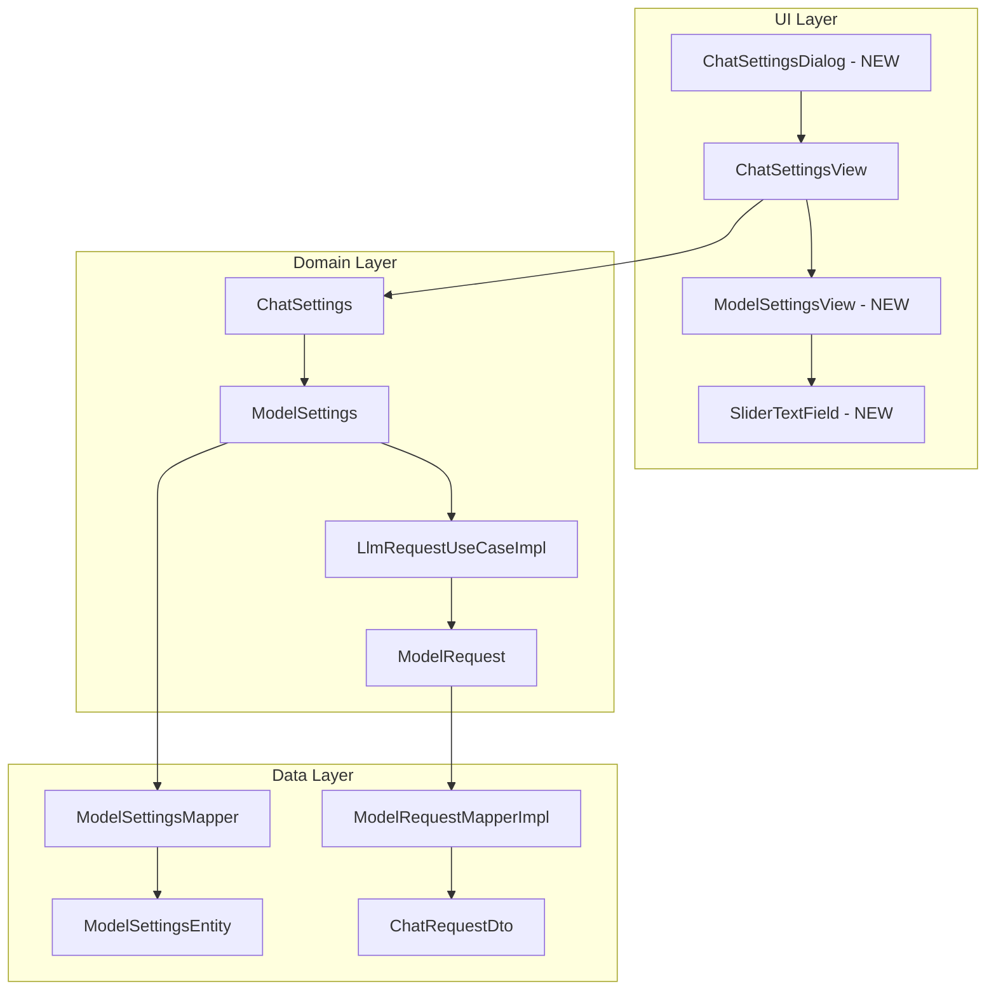

# План: Расширение настроек ChatSettings и ModelSettings

## Обзор задачи

Добавить возможность настройки дополнительных параметров LLM в ChatSettingsView:
- `top_p` (Double?, 0-1)
- `top_k` (Int?, положительное)
- `max_tokens` (Int?, уже есть, но нужно сделать nullable)
- `max_completion_tokens` (Int?, положительное)
- `presence_penalty` (Double?, -2 до 2)
- `frequency_penalty` (Double?, -2 до 2)
- `seed` (Int?, любое целое)

## Архитектура изменений



## Детальный план

### 1. Domain слой: ModelSettings

**Файл:** `app/src/main/java/com/example/day/core/core_features/llm/domain/model/ModelSettings.kt`

Добавить новые nullable поля:
```kotlin
data class ModelSettings(
    val name: String,
    val stopSequence: ImmutableList<String> = emptyList<String>().toImmutableList(),
    val maxTokens: Int? = null,  // изменить с Int на Int?
    val maxCompletionTokens: Int? = null,  // NEW
    val jsonFormat: Boolean = false,
    val temperature: Double? = null,
    val topP: Double? = null,  // NEW
    val topK: Int? = null,  // NEW
    val presencePenalty: Double? = null,  // NEW
    val frequencyPenalty: Double? = null,  // NEW
    val seed: Int? = null,  // NEW
    val reasoningEffort: String? = null
)
```

### 2. Data слой: ModelSettingsEntity

**Файл:** `app/src/main/java/com/example/day/core/core_features/chat/data/local/model/ModelSettingsEntity.kt`

Добавить соответствующие поля в Entity:
```kotlin
@Serializable
internal data class ModelSettingsEntity(
    val name: String,
    val stopSequence: List<String> = emptyList(),
    val maxTokens: Int? = null,  // изменить на nullable
    val maxCompletionTokens: Int? = null,  // NEW
    val jsonFormat: Boolean = false,
    val temperature: Double? = null,
    val topP: Double? = null,  // NEW
    val topK: Int? = null,  // NEW
    val presencePenalty: Double? = null,  // NEW
    val frequencyPenalty: Double? = null,  // NEW
    val seed: Int? = null,  // NEW
    val reasoningEffort: String? = null
)
```

### 3. Data слой: ModelSettingsMapper

**Файл:** `app/src/main/java/com/example/day/core/core_features/chat/data/local/mapper/ModelSettingsMapper.kt`

Обновить мапперы для новых полей.

### 4. Domain слой: LlmRequestUseCaseImpl

**Файл:** `app/src/main/java/com/example/day/core/core_features/llm/domain/LlmRequestUseCaseImpl.kt`

Добавить передачу новых параметров в ModelRequest:
```kotlin
val request = ModelRequest(
    // ... existing fields
    topP = modelSettings.topP,
    topK = modelSettings.topK,
    presencePenalty = modelSettings.presencePenalty,
    frequencyPenalty = modelSettings.frequencyPenalty,
    seed = modelSettings.seed,
    maxCompletionTokens = modelSettings.maxCompletionTokens
)
```

### 5. UI слой: SliderTextField компонент

**Новый файл:** `app/src/main/java/com/example/day/features/console/impl/ui/components/SliderTextField.kt`

Компонент для ввода числовых значений с полем ввода и слайдером:
- Текстовое поле для ввода значения
- Слайдер для визуального выбора
- Поддержка диапазонов (min, max)
- Поддержка nullable значений (пустое поле = null)

### 6. UI слой: ModelSettingsView компонент

**Новый файл:** `app/src/main/java/com/example/day/features/console/impl/ui/components/ModelSettingsView.kt`

Отдельный компонент для настройки ModelSettings:
- Поле model name (редактируемое)
- Параметры с SliderTextField: temperature, topP, topK, presencePenalty, frequencyPenalty
- Поле maxTokens (Int?)
- Поле maxCompletionTokens (Int?)
- Поле seed (Int?)
- Поле reasoningEffort (текстовое)
- Чекбокс jsonFormat
- Поле stopSequence

### 7. UI слой: Рефакторинг ChatSettingsView

**Файл:** `app/src/main/java/com/example/day/features/console/impl/ui/components/ChatSettingsView.kt`

Изменения:
- Вынести ModelSettings в отдельный ModelSettingsView компонент
- Оставить только systemPrompt в ChatSettingsView
- Сделать кнопки Ok/Cancel фиксированными внизу при прокрутке

Структура:
```
Column {
    Title
    SystemPrompt (многострочное поле)
    ModelSettingsView (свернутый/развернутый блок или просто вложенный)
    Row (кнопки) - фиксированы внизу
}
```

### 8. UI слой: ChatSettingsDialog

**Новый файл:** `app/src/main/java/com/example/day/features/console/impl/ui/components/ChatSettingsDialog.kt`

Composable функция-обертка для отображения ChatSettingsView как модального диалога:
```kotlin
@Composable
fun ChatSettingsDialog(
    state: ChatSettingsUiModel,
    onDismiss: () -> Unit,
    onSubmit: (ChatSettings) -> Unit,
    colors: ChatUiColors = LocalChatColors.current
)
```

## Порядок реализации

1. **Domain слой** - ModelSettings (добавить поля)
2. **Data слой** - ModelSettingsEntity + ModelSettingsMapper
3. **Domain слой** - LlmRequestUseCaseImpl (передача параметров)
4. **UI слой** - SliderTextField компонент
5. **UI слой** - ModelSettingsView компонент
6. **UI слой** - Рефакторинг ChatSettingsView
7. **UI слой** - ChatSettingsDialog функция

## Вопросы для уточнения

- [x] Типы параметров и диапазоны - подтверждены
- [x] UI для параметров - поле ввода + слайдер
- [x] Модальный диалог - отдельная Composable функция
- [x] Model name - редактируемое текстовое поле

## Риски и зависимости

1. **Обратная совместимость:** Изменение `maxTokens: Int` на `maxTokens: Int?` может потребовать миграции базы данных
2. **Валидация:** Нужно добавить валидацию диапазонов на UI уровне
3. **Сериализация:** Nullable поля в ModelSettingsEntity должны корректно сериализоваться/десериализоваться
