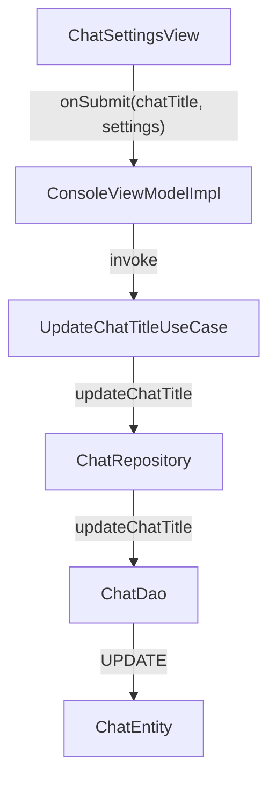

# План: Добавление редактирования названия чата в ChatSettingsView

## Обзор задачи

Добавить возможность редактирования названия чата (Chat.title) в ChatSettingsView.

## Текущая структура

```
ChatSettingsUiModel
├── title: String (заголовок диалога)
└── settingsState: ChatSettings
    ├── chatId: Long
    ├── systemPromt: String
    └── model: ModelSettings
```

Название чата хранится в Chat entity (поле title).

## Выбранный вариант реализации

Добавить `updateChatTitle` в ChatRepository и ChatDao + создать use case.

## Детальный план

### 1. Data слой: ChatDao

**Файл:** `app/src/main/java/com/example/day/core/core_features/chat/data/local/dao/ChatDao.kt`

Добавить метод для обновления названия:
```kotlin
@Query("UPDATE chats SET title = :title WHERE id = :chatId")
suspend fun updateChatTitle(chatId: Long, title: String)
```

### 2. Domain слой: ChatRepository

**Файл:** `app/src/main/java/com/example/day/core/core_features/chat/domain/ChatRepository.kt`

Добавить метод интерфейса:
```kotlin
suspend fun updateChatTitle(chatId: Long, title: String)
```

### 3. Data слой: ChatRepositoryImpl

**Файл:** `app/src/main/java/com/example/day/core/core_features/chat/data/ChatRepositoryImpl.kt`

Добавить реализацию:
```kotlin
override suspend fun updateChatTitle(chatId: Long, title: String) {
    chatDao.updateChatTitle(chatId, title)
}
```

### 4. Domain слой: UpdateChatTitleUseCase (NEW)

**Новый файл:** `app/src/main/java/com/example/day/core/core_features/chat/domain/usecase/UpdateChatTitleUseCase.kt`

Создать use case:
```kotlin
class UpdateChatTitleUseCase(
    private val chatRepository: ChatRepository
) {
    suspend operator fun invoke(chatId: Long, title: String) {
        chatRepository.updateChatTitle(chatId, title)
    }
}
```

### 5. UI слой: ChatSettingsUiModel

**Файл:** `app/src/main/java/com/example/day/features/console/impl/ui/components/ChatSettingsUiModel.kt`

Добавить поле для названия чата:
```kotlin
data class ChatSettingsUiModel(
    val title: String,           // заголовок диалога (существующее)
    val chatTitle: String,      // NEW - название чата для редактирования
    val settingsState: ChatSettings
)
```

### 6. UI слой: ChatSettingsView

**Файл:** `app/src/main/java/com/example/day/features/console/impl/ui/components/ChatSettingsView.kt`

Изменения:
- Добавить состояние (state) для chatTitle
- Добавить текстовое поле "Название чата" в начале формы
- Изменить callback onSubmit: `onSubmit: (chatTitle: String, ChatSettings) -> Unit`

### 7. UI слой: ConsoleViewModelImpl

**Файл:** `app/src/main/java/com/example/day/features/console/impl/ui/viewmodel/ConsoleViewModelImpl.kt`

Изменения:

1. При открытии настроек передавать название чата:
```kotlin
ConsoleViewModel.Event.OpenSettingsClick -> {
    chatSettings?.let { settings ->
        _state.update { it.copy(
            settings = ChatSettingsUiModel(
                title = "Настройки",
                chatTitle = chat?.title ?: "",  // NEW
                settingsState = settings
            )
        )}
    }
}
```

2. При сохранении - вызов UpdateChatTitleUseCase:
```kotlin
is ConsoleViewModel.Event.SettingsSubmitClick -> {
    val (chatTitle, settings) = event
    chatSettings = settings
    _state.update { it.copy(settings = null) }
    viewModelScope.launch {
        updateChatSettingsUseCase(settings)
        // Обновить название чата
        chat?.let { currentChat ->
            if (currentChat.title != chatTitle) {
                updateChatTitleUseCase(currentChat.id, chatTitle)
            }
        }
    }
}
```

Примечание: Изменяем callback на `onSubmit(chatTitle: String, ChatSettings)`.

### 8. DI: Регистрация use case

**Файл:** `app/src/main/java/com/example/day/core/core_features/chat/di/ChatCoreFeatureModule.kt`

Добавить:
```kotlin
factory { UpdateChatTitleUseCase(get()) }
```

## Диаграмма потока данных



## Дополнительные изменения

### 9. UI слой: ConsoleViewModel.Event

**Файл:** `app/src/main/java/com/example/day/features/console/impl/ui/viewmodel/ConsoleViewModel.kt`

Изменить Event:
```kotlin
class SettingsSubmitClick(
    val chatTitle: String,
    val result: ChatSettings
) : Event
```

### 10. UI слой: ChatSettingsDialog

**Файл:** `app/src/main/java/com/example/day/features/console/impl/ui/components/ChatSettingsDialog.kt`

Изменить callback:
```kotlin
fun ChatSettingsDialog(
    state: ChatSettingsUiModel,
    onDismiss: () -> Unit,
    onSubmit: (chatTitle: String, ChatSettings) -> Unit,
    colors: ChatUiColors = LocalChatColors.current
)
```

## Порядок реализации

1. **Data слой** - ChatDao (добавить update query)
2. **Domain слой** - ChatRepository interface
3. **Data слой** - ChatRepositoryImpl
4. **Domain слой** - UpdateChatTitleUseCase (новый)
5. **DI** - Зарегистрировать use case
6. **UI слой** - ChatSettingsUiModel (добавить chatTitle)
7. **UI слой** - ChatSettingsView (добавить текстовое поле, изменить callback)
8. **UI слой** - ChatSettingsDialog (изменить callback)
9. **UI слой** - ConsoleViewModel.Event (изменить SettingsSubmitClick)
10. **UI слой** - ConsoleViewModelImpl (вызов use case)

## Вопросы для уточнения

- [x] Добавить updateChatTitle в ChatRepository и ChatDao - подтверждено
- [x] Создать UpdateChatTitleUseCase - подтверждено
