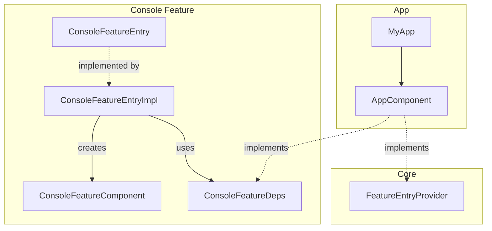

# Оценка рекомендаций по Dagger FeatureComponentHolder

## Текущая архитектура проекта

Проект уже использует проверенный паттерн **FeatureEntry**, который концептуально близок к рекомендуемому `FeatureComponentHolder`, но лучше интегрирован с Compose:



### Ключевые элементы текущей реализации:

1. **FeatureEntry** — интерфейс с Composable `EntryPoint()`
2. **FeatureEntryImpl** — создаёт компонент через `retain { }`
3. **FeatureDeps** — интерфейс зависимостей (реализуется AppComponent)
4. **FeatureComponent** — субкомпонент с собственным scope

---

## Анализ рекомендаций

### ✅ Что реализовано правильно:

| Аспект | Рекомендация | Текущая реализация |
|--------|--------------|-------------------|
| Изоляция модулей | Deps — интерфейс в фиче | ✅ [`ConsoleFeatureDeps`](app/src/main/java/com/example/day/features/console/impl/di/ConsoleFeatureDeps.kt) |
| Feature Scope | Собственный @Scope | ✅ [`ConsoleFeatureScope`](app/src/main/java/com/example/day/features/console/impl/di/ConsoleFeatureScope.kt) |
| Component Factory | Dagger factory pattern | ✅ [`ConsoleFeatureComponent.Factory`](app/src/main/java/com/example/day/features/console/impl/di/ConsoleFeatureComponent.kt:13) |
| API/Impl разделение | FeatureEntry + Impl | ✅ [`ConsoleFeatureEntry`](app/src/main/java/com/example/day/features/console/api/ConsoleFeatureEntry.kt) + [`ConsoleFeatureEntryIml`](app/src/main/java/com/example/day/features/console/impl/ConsoleFeatureEntryIml.kt) |

---

### ⚠️ Проблемы рекомендаций:

#### 1. **ComponentHolder — избыточный слой для Compose**

Рекомендуемый код:
```kotlin
object ConsoleFeatureComponentHolder : ComponentHolder<...> {
    override fun init(deps: ConsoleFeatureDeps) { ... }
    override fun get(): Api = ...
    override fun reset() { ... }
}
```

**Проблемы:**
- ❌ Требует ручного вызова `reset()` — легко забыть
- ❌ Дублирует логику инициализации в Application
- ❌ НЕ интегрируется с Compose lifecycle

**Текущее решение лучше:**
```kotlin
@Composable
fun EntryPoint(chatId: Long, modifier: Modifier) {
    val featureComponent = retain {
        DaggerConsoleFeatureComponent.factory().create(appComponent)
    }
    // Автоматическая очистка при выходе из composition
}
```

---

#### 2. **Инициализация в Application — антипаттерн для FeatureEntry**

Рекомендация:
```kotlin
class MyApp : Application() {
    override fun onCreate() {
        ConsoleFeatureComponentHolder.init(appComponent) // ❌
        ChatsFeatureComponentHolder.init(appComponent)    // ❌
    }
}
```

**Проблемы:**
- Все фичи инициализируются при старте приложения
- Нет lazy loading
- Противоречит принципу "плати только за то, что используешь"

**Текущее решение:**
```kotlin
// Инициализация происходит только при первом использовании
val featureComponent = retain { ... }
```

---

#### 3. **4 файла — не всегда оптимально**

Рекомендация требует создания:
1. FeatureDeps (Interface)
2. FeatureApi (Interface)  
3. FeatureComponent (Dagger Component)
4. FeatureComponentHolder (Singleton Object)

**Текущий проект уже имеет:**
1. FeatureDeps ✅
2. FeatureEntry (вместо FeatureApi) ✅
3. FeatureComponent ✅
4. FeatureEntryImpl (вместо ComponentHolder) ✅

Дополнительный ComponentHolder — это **пятый** файл, а не замена существующим.

---

## Вердикт

### Рекомендация: **Частично устарела для Compose-проектов**

**Причины:**
1. Рекомендация написана для чистого Dagger без учёта Compose-специфики
2. Паттерн `retain { }` в Compose — более элегантное решение для lifecycle management
3. FeatureEntry уже реализует ту же цель с лучшей интеграцией

### Когда ComponentHolder может быть полезен:
- Вне Compose (View-based UI)
- Сложные сценарии с явным контролем lifecycle
- Дополнительный слой абстракции для сложных навигационных сценариев

---

## Рекомендации по улучшению текущей архитектуры

### Вместо добавления ComponentHolder, рассмотрите:

1. **Common FeatureEntry base** — общий интерфейс для всех EntryPoints
   ```kotlin
   interface FeatureEntry<PointArgs> {
       @Composable
       fun EntryPoint(args: PointArgs, modifier: Modifier)
   }
   ```

2. **BaseFeatureDeps** — общий интерфейс для всех Deps
   ```kotlin
   interface BaseFeatureDeps {
       val appComponent: AppComponent
   }
   ```

3. **Centralized scope management** — если нужен явный reset:
   ```kotlin
   object FeatureScopeManager {
       private val scopes = mutableMapOf<String, Scope>()
       fun release(scope: String) { ... }
   }
   ```

---

## Вывод

**Текущая архитектура проекта — это Modern Best Practice для Compose-приложений на Dagger.**

Рекомендация ComponentHolder была актуальна для:
- Старых View-систем
- Крупных проектов без Compose
- Сложных модульных приложений с ручным управлением lifecycle

Для данного проекта **не рекомендуется** внедрять ComponentHolder, так как:
1. Это создаст избыточный слой
2. Потребует рефакторинга существующих FeatureEntry
3. Не даст значимых преимуществ в контексте Compose

**Рекомендуемое действие:** Оставить текущую архитектуру FeatureEntry, но документировать паттерн для новых разработчиков.

---

## Встречная рекомендация: Dependency Provider (Сбер-паттерн)

### Суть подхода:

```kotlin
// 1. CoreDeps - общие зависимости
interface CoreDeps {
    fun chatRepository(): ChatRepository
    fun agentRepository(): AgentRepository
}

// 2. AppComponent реализует только CoreDeps
interface AppComponent : CoreDeps { ... }

// 3. FeatureEntry создаёт анонимный FeatureDeps
class ConsoleFeatureEntryImpl : ConsoleFeatureEntry {
    override fun register(coreDeps: CoreDeps) {
        val component = retain {
            DaggerConsoleFeatureComponent.factory().create(
                object : ConsoleFeatureDeps {
                    override fun chatRepo() = coreDeps.chatRepository()
                }
            )
        }
    }
}
```

---

### Критический анализ:

#### ✅ Что улучшается:

| Аспект | Описание |
|--------|----------|
| Изоляция CoreDeps | Стабильные зависимости отделены от волатильных |
| AppComponent чище | Не засорён специфичными методами фич |
| Feature autonomy | Фича сама решает как маппить CoreDeps → FeatureDeps |

#### ⚠️ Проблемы:

1. **Анонимные объекты — потеря type safety**
   ```kotlin
   object : ConsoleFeatureDeps { ... }  // ❌ Нет compile-time проверки
   ```
   В текущем подходе AppComponent implements ConsoleFeatureDeps — ошибка видна на этапе компиляции.

2. **Дублирование маппинга**
   Каждая фича должна написать свой `object : FeatureDeps { ... }` — boilerplate.

3. **AppComponent всё равно нужно менять**
   - Добавили новую фичу → нужен новый FeatureDeps интерфейс
   - CoreDeps меняется редко, но FeatureDeps — часто
   - Преимущество сомнительное

4. **Coupling с Navigation**
   ```kotlin
   fun register(navGraphBuilder: NavGraphBuilder, ...)  //强 coupling
   ```
   Привязка к конкретной навигационной библиотеке — теряется переиспользование.

---

### Сравнение трёх подходов:

| Критерий | Текущий (FeatureEntry) | ComponentHolder | Dependency Provider |
|----------|----------------------|-----------------|---------------------|
| Type Safety | ✅ Compile-time | ✅ Compile-time | ❌ Runtime |
| Boilerplate | ✅ Минимальный | ⚠️ Средний | ❌ Высокий |
| AppComponent size | ⚠️ Растёт | ⚠️ Растёт | ✅ Компактный |
| Navigation coupling | ✅ Независим | ❌ Ручной | ❌ Привязан |
| Testability | ✅ Хорошая | ✅ Хорошая | ✅ Хорошая |
| Compose integration | ✅ retain | ⚠️ Ручной reset | ✅ retain |

---

### Вердикт по Dependency Provider:

** Marginal improvement ** — предлагает более чистый AppComponent ценой:
- Потери type safety при компиляции
- Дублирования кода маппинга
- Привязки к Navigation

**Рекомендация:** Для текущего проекта текущая архитектура FeatureEntry предпочтительна. Dependency Provider имел бы смысл в очень крупных проектах с десятками фич и отдельными командами.

---

## Дополнительно: Анализ AgMessageHandler и Multibindings

### Текущая реализация:

```kotlin
// ChatCommand - в :features:console:impl:domain:agents
enum class ChatCommand(val title: String) {
    SimpleWork("@@simple"),
    Talk("@@talk"),
    // ...
}

// AWorker - в :core:core_features:agent:domain:workers:base
interface AWorker {
    suspend fun doWork(task: String, chat: Chat, onEvent: ...?)
}

// AgMessageHandler - "Fat Constructor" проблема
internal class AgMessageHandler @Inject constructor(
    simpleWorker: SimpleWorker,
    stepWorker: StepWorker,
    // ... 6 workers total
    private val chatTools: ChatTools
) {
    private val commandToWorker: Map<ChatCommand, AWorker> = mapOf(...)
}
```

---

### Оценка рекомендаций:

#### ✅ Здравое зерно:

| Проблема | Описание | Актуальность |
|----------|----------|-------------|
| Fat Constructor | При 20+ воркерах конструктор станет огромным | ⚠️ Пока 6 воркеров — не критично |
| O(n) поиск | Linear search по Map.entries | ✅ Справедливое замечание |
| Fallback | Нет дефолтного worker | ⚠️ UX момент |

#### ⚠️ Проблемы предлагаемого решения:

1. **Circular Dependency:**
   - ChatCommand в UI-модуле
   - Workers в Core-модуле
   - Multibindings требует ключ в том же модуле, где binding

2. **Перенос ChatCommand в Core — компромисс:**
   - ✅ Решает циклическую зависимость
   - ✅ Это бизнес-логика (какой "мозг" обрабатывает текст)
   - ❌ Тесная связь console ↔ core:agent

3. **Сложность vs Бенефит:**
   - Текущее решение работает для 6 воркеров
   - Multibindings добавляет complexity
   - Преждевременная оптимизация?

---

### Рекомендация:

**Пока не рефакторить** — текущая реализация соответствует принципу YAGNI:
- 6 воркеров — это немного
- Конструктор читаемый
- O(6) = O(1) в практическом смысле

**Когда понадобится (признаки):**
- Воркеров станет > 10
- Появятся динамические воркеры (плагины)
- Команды начнут добавлять не-разработчики

**Если рефакторить — план:**
1. Перенести ChatCommand в core:agent:domain
2. Создать `@MapKey` аннотацию
3. Создать WorkerModule с @IntoMap
4. Инжектировать `Map<ChatCommand, AWorker>`
