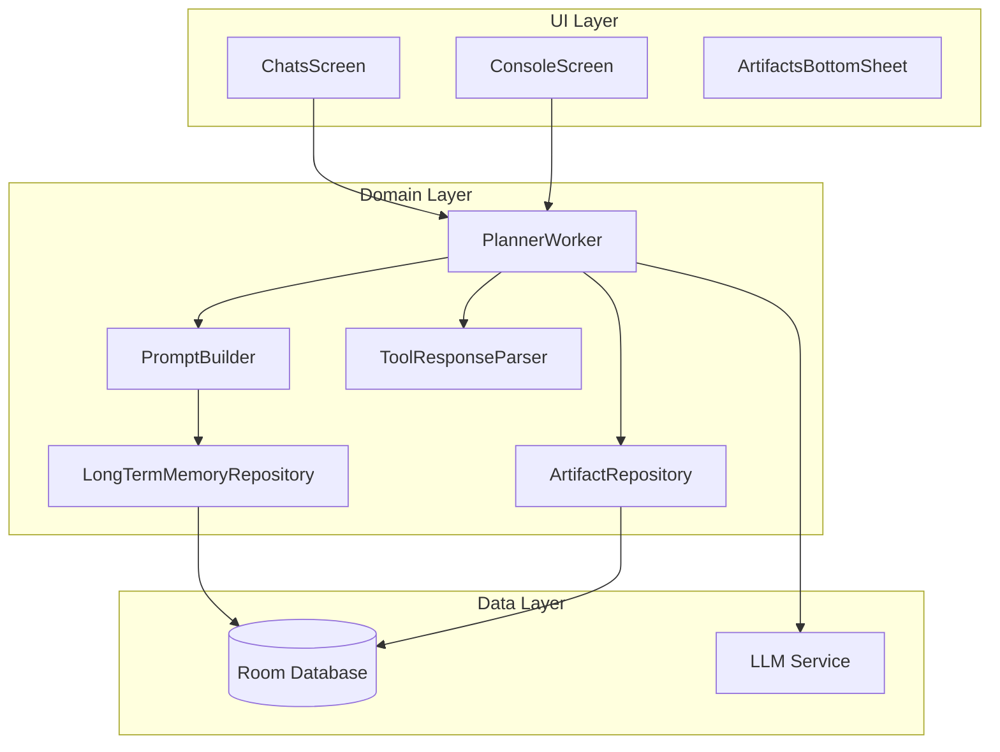

# Day 11: MVP Implementation Plan

## Overview

This document provides a detailed, step-by-step implementation plan for the **MVP** version of the Planner chat group type with three-layer memory architecture.

**Key Design Decisions (from clarification):**
- No native function calling - use pattern matching
- Single PlannerWorker detects chat type (main vs stage)
- Stage chats appear in same list as regular chats
- Working memory at ChatEntity level with parent context injection
- No DB migration needed (fresh install or destructive migration)
- **Stage creation ONLY after explicit user confirmation (Human-in-the-loop)**

---

## Architecture Overview



---

## Phase 1: Database Foundation

### Step 1.1: Add PLANNER ChatType

**File:** `core/core_features/chat/domain/model/ChatType.kt`

```kotlin
enum class ChatType(val dbType: String, val title: String) {
    SIMPLE_HISTORY("simple_history", "Simple History"),
    AGENT_COMMANDS("agent_commands", "Agent Commands"),
    PLANNER("planner", "Project Planner");  // NEW

    companion object {
        fun fromDbType(dbType: String): ChatType? {
            return enumValues<ChatType>().find { it.dbType == dbType }
        }
    }
}
```

### Step 1.2: Extend ChatEntity

**File:** `core/core_features/chat/data/local/model/ChatEntity.kt`

```kotlin
@Entity(
    tableName = "chats",
    foreignKeys = [
        ForeignKey(
            entity = ChatGroupEntity::class,
            parentColumns = ["id"],
            childColumns = ["chat_group_id"],
            onDelete = ForeignKey.CASCADE
        ),
        ForeignKey(
            entity = ChatEntity::class,
            parentColumns = ["id"],
            childColumns = ["parent_id"],
            onDelete = ForeignKey.SET_NULL
        )
    ],
    indices = [
        Index(value = ["chat_group_id"]),
        Index(value = ["parent_id"])
    ]
)
internal data class ChatEntity(
    @PrimaryKey(autoGenerate = true)
    @ColumnInfo(name = "id")
    val id: Long = 0,
    
    @ColumnInfo(name = "title")
    val title: String,
    
    @ColumnInfo(name = "chat_group_id")
    val chatGroupId: Long,
    
    @ColumnInfo(name = "parent_id")
    val parentId: Long? = null,  // NEW: for stage chats
    
    @ColumnInfo(name = "working_summary")
    val workingSummary: String? = null,  // NEW: Working Memory
    
    @ColumnInfo(name = "is_planner_main")
    val isPlannerMain: Boolean = false  // NEW: true for main planner chat
)
```

### Step 1.3: Create LongTermMemoryEntity

**File:** `core/core_features/chat/data/local/model/LongTermMemoryEntity.kt`

```kotlin
package com.example.day.core.core_features.chat.data.local.model

import androidx.room.ColumnInfo
import androidx.room.Entity
import androidx.room.PrimaryKey

/**
 * Long-term memory storage for user facts and preferences.
 * Uses memoryKey for UPSERT operations.
 */
@Entity(tableName = "long_term_memory")
internal data class LongTermMemoryEntity(
    @PrimaryKey
    @ColumnInfo(name = "memory_key")
    val memoryKey: String,
    
    @ColumnInfo(name = "category")
    val category: String,  // e.g., "skills", "preferences", "experience"
    
    @ColumnInfo(name = "fact")
    val fact: String,
    
    @ColumnInfo(name = "updated_at")
    val updatedAt: Long = System.currentTimeMillis()
)
```

### Step 1.4: Create ProjectArtifactEntity

**File:** `core/core_features/chat/data/local/model/ProjectArtifactEntity.kt`

```kotlin
package com.example.day.core.core_features.chat.data.local.model

import androidx.room.ColumnInfo
import androidx.room.Entity
import androidx.room.ForeignKey
import androidx.room.Index
import androidx.room.PrimaryKey

/**
 * Stores final results/outcomes from completed stage chats.
 */
@Entity(
    tableName = "project_artifacts",
    foreignKeys = [
        ForeignKey(
            entity = ChatEntity::class,
            parentColumns = ["id"],
            childColumns = ["chat_id"],
            onDelete = ForeignKey.CASCADE
        )
    ],
    indices = [Index(value = ["chat_id"])]
)
internal data class ProjectArtifactEntity(
    @PrimaryKey(autoGenerate = true)
    @ColumnInfo(name = "id")
    val id: Long = 0,
    
    @ColumnInfo(name = "chat_id")
    val chatId: Long,
    
    @ColumnInfo(name = "stage_title")
    val stageTitle: String,
    
    @ColumnInfo(name = "content")
    val content: String,
    
    @ColumnInfo(name = "created_at")
    val createdAt: Long = System.currentTimeMillis()
)
```

### Step 1.5: Update ChatDatabase

**File:** `core/core_features/chat/data/local/ChatDatabase.kt`

```kotlin
@Database(
    entities = [
        UserEntity::class,
        ChatEntity::class,
        MessageEntity::class,
        ChatTypeEntity::class,
        ChatGroupEntity::class,
        ChatSettingsEntity::class,
        AgentEntity::class,
        AgentToChatEntity::class,
        AgentContextMemoryEntity::class,
        LongTermMemoryEntity::class,  // NEW
        ProjectArtifactEntity::class  // NEW
    ],
    version = 5,  // Incremented from 4
    exportSchema = false
)
internal abstract class ChatDatabase : RoomDatabase() {
    abstract fun userDao(): UserDao
    abstract fun chatDao(): ChatDao
    abstract fun messageDao(): MessageDao
    abstract fun chatTypeDao(): ChatTypeDao
    abstract fun chatGroupDao(): ChatGroupDao
    abstract fun chatSettingsDao(): ChatSettingsDao
    abstract fun agentDao(): AgentDao
    abstract fun agentToChatDao(): AgentToChatDao
    abstract fun agentContextMemoryDao(): AgentContextMemoryDao
    abstract fun longTermMemoryDao(): LongTermMemoryDao  // NEW
    abstract fun artifactDao(): ArtifactDao  // NEW
}
```

### Step 1.6: Create DAOs

**File:** `core/core_features/chat/data/local/dao/LongTermMemoryDao.kt`

```kotlin
package com.example.day.core.core_features.chat.data.local.dao

import androidx.room.Dao
import androidx.room.Insert
import androidx.room.OnConflictStrategy
import androidx.room.Query
import com.example.day.core.core_features.chat.data.local.model.LongTermMemoryEntity
import kotlinx.coroutines.flow.Flow

@Dao
internal interface LongTermMemoryDao {
    
    @Insert(onConflict = OnConflictStrategy.REPLACE)
    suspend fun upsert(memory: LongTermMemoryEntity)
    
    @Query("SELECT * FROM long_term_memory ORDER BY updated_at DESC")
    fun getAll(): Flow<List<LongTermMemoryEntity>>
    
    @Query("SELECT * FROM long_term_memory ORDER BY updated_at DESC")
    suspend fun getAllOnce(): List<LongTermMemoryEntity>
    
    @Query("SELECT * FROM long_term_memory WHERE memory_key = :key")
    suspend fun getByKey(key: String): LongTermMemoryEntity?
    
    @Query("DELETE FROM long_term_memory WHERE memory_key = :key")
    suspend fun deleteByKey(key: String)
    
    @Query("DELETE FROM long_term_memory")
    suspend fun clearAll()
}
```

**File:** `core/core_features/chat/data/local/dao/ArtifactDao.kt`

```kotlin
package com.example.day.core.core_features.chat.data.local.dao

import androidx.room.Dao
import androidx.room.Insert
import androidx.room.Query
import com.example.day.core.core_features.chat.data.local.model.ProjectArtifactEntity
import kotlinx.coroutines.flow.Flow

@Dao
internal interface ArtifactDao {
    
    @Insert
    suspend fun insert(artifact: ProjectArtifactEntity): Long
    
    @Query("SELECT * FROM project_artifacts WHERE chat_id = :chatId ORDER BY created_at DESC")
    fun getByChatId(chatId: Long): Flow<List<ProjectArtifactEntity>>
    
    @Query("""
        SELECT * FROM project_artifacts 
        WHERE chat_id IN (
            SELECT id FROM chats WHERE parent_id = :parentId
        ) 
        ORDER BY created_at ASC
    """)
    fun getByParentChatId(parentId: Long): Flow<List<ProjectArtifactEntity>>
    
    @Query("DELETE FROM project_artifacts WHERE chat_id = :chatId")
    suspend fun deleteByChatId(chatId: Long)
}
```

### Step 1.7: Extend ChatDao

**Add to existing** `core/core_features/chat/data/local/dao/ChatDao.kt`:

```kotlin
@Query("SELECT * FROM chats WHERE parent_id = :parentId ORDER BY id ASC")
fun getSubChats(parentId: Long): Flow<List<ChatEntity>>

@Query("SELECT * FROM chats WHERE parent_id = :parentId ORDER BY id ASC")
suspend fun getSubChatsOnce(parentId: Long): List<ChatEntity>

@Query("UPDATE chats SET working_summary = :summary WHERE id = :chatId")
suspend fun updateWorkingSummary(chatId: Long, summary: String)

@Query("UPDATE chats SET is_planner_main = :isMain WHERE id = :chatId")
suspend fun updateIsPlannerMain(chatId: Long, isMain: Boolean)

@Query("SELECT * FROM chats WHERE chat_group_id = :groupId AND is_planner_main = 1 LIMIT 1")
suspend fun getMainPlannerChat(groupId: Long): ChatEntity?
```

---

## Phase 2: Domain Layer

### Step 2.1: Create Domain Models

**File:** `core/core_features/chat/domain/model/LongTermMemory.kt`

```kotlin
package com.example.day.core.core_features.chat.domain.model

data class LongTermMemory(
    val memoryKey: String,
    val category: String,
    val fact: String,
    val updatedAt: Long
)
```

**File:** `core/core_features/chat/domain/model/ProjectArtifact.kt`

```kotlin
package com.example.day.core.core_features.chat.domain.model

data class ProjectArtifact(
    val id: Long,
    val chatId: Long,
    val stageTitle: String,
    val content: String,
    val createdAt: Long
)
```

### Step 2.2: Create Repository Interfaces

**File:** `core/core_features/chat/domain/LongTermMemoryRepository.kt`

```kotlin
package com.example.day.core.core_features.chat.domain

import com.example.day.core.core_features.chat.domain.model.LongTermMemory
import kotlinx.coroutines.flow.Flow

interface LongTermMemoryRepository {
    suspend fun saveFact(key: String, category: String, fact: String)
    suspend fun getAllFacts(): List<LongTermMemory>
    fun getAllFactsFlow(): Flow<List<LongTermMemory>>
    suspend fun deleteFact(key: String)
    suspend fun clearAll()
}
```

**File:** `core/core_features/chat/domain/ArtifactRepository.kt`

```kotlin
package com.example.day.core.core_features.chat.domain

import com.example.day.core.core_features.chat.domain.model.ProjectArtifact
import kotlinx.coroutines.flow.Flow

interface ArtifactRepository {
    suspend fun saveArtifact(chatId: Long, stageTitle: String, content: String)
    fun getArtifactsForChat(chatId: Long): Flow<List<ProjectArtifact>>
    fun getArtifactsForParent(parentId: Long): Flow<List<ProjectArtifact>>
}
```

### Step 2.3: Create Repository Implementations

**File:** `core/core_features/chat/data/LongTermMemoryRepositoryImpl.kt`

```kotlin
package com.example.day.core.core_features.chat.data

import com.example.day.core.core_features.chat.data.local.dao.LongTermMemoryDao
import com.example.day.core.core_features.chat.data.local.model.LongTermMemoryEntity
import com.example.day.core.core_features.chat.domain.LongTermMemoryRepository
import com.example.day.core.core_features.chat.domain.model.LongTermMemory
import kotlinx.coroutines.flow.Flow
import kotlinx.coroutines.flow.map
import javax.inject.Inject

internal class LongTermMemoryRepositoryImpl @Inject constructor(
    private val dao: LongTermMemoryDao
) : LongTermMemoryRepository {
    
    override suspend fun saveFact(key: String, category: String, fact: String) {
        dao.upsert(
            LongTermMemoryEntity(
                memoryKey = key,
                category = category,
                fact = fact
            )
        )
    }
    
    override suspend fun getAllFacts(): List<LongTermMemory> {
        return dao.getAllOnce().map { it.toDomain() }
    }
    
    override fun getAllFactsFlow(): Flow<List<LongTermMemory>> {
        return dao.getAll().map { list -> list.map { it.toDomain() } }
    }
    
    override suspend fun deleteFact(key: String) {
        dao.deleteByKey(key)
    }
    
    override suspend fun clearAll() {
        dao.clearAll()
    }
    
    private fun LongTermMemoryEntity.toDomain() = LongTermMemory(
        memoryKey = memoryKey,
        category = category,
        fact = fact,
        updatedAt = updatedAt
    )
}
```

**File:** `core/core_features/chat/data/ArtifactRepositoryImpl.kt`

```kotlin
package com.example.day.core.core_features.chat.data

import com.example.day.core.core_features.chat.data.local.dao.ArtifactDao
import com.example.day.core.core_features.chat.data.local.model.ProjectArtifactEntity
import com.example.day.core.core_features.chat.domain.ArtifactRepository
import com.example.day.core.core_features.chat.domain.model.ProjectArtifact
import kotlinx.coroutines.flow.Flow
import kotlinx.coroutines.flow.map
import javax.inject.Inject

internal class ArtifactRepositoryImpl @Inject constructor(
    private val dao: ArtifactDao
) : ArtifactRepository {
    
    override suspend fun saveArtifact(chatId: Long, stageTitle: String, content: String) {
        dao.insert(
            ProjectArtifactEntity(
                chatId = chatId,
                stageTitle = stageTitle,
                content = content
            )
        )
    }
    
    override fun getArtifactsForChat(chatId: Long): Flow<List<ProjectArtifact>> {
        return dao.getByChatId(chatId).map { list -> list.map { it.toDomain() } }
    }
    
    override fun getArtifactsForParent(parentId: Long): Flow<List<ProjectArtifact>> {
        return dao.getByParentChatId(parentId).map { list -> list.map { it.toDomain() } }
    }
    
    private fun ProjectArtifactEntity.toDomain() = ProjectArtifact(
        id = id,
        chatId = chatId,
        stageTitle = stageTitle,
        content = content,
        createdAt = createdAt
    )
}
```

### Step 2.4: Extend ChatRepository

**Add to ChatRepository interface:**

```kotlin
suspend fun createSubChat(parentId: Long, title: String, workingSummary: String?): Long
suspend fun getSubChats(parentId: Long): List<Chat>
fun getSubChatsFlow(parentId: Long): Flow<List<Chat>>
suspend fun updateWorkingSummary(chatId: Long, summary: String)
suspend fun getMainPlannerChat(groupId: Long): Chat?
```

**Implement in ChatRepositoryImpl:**

```kotlin
override suspend fun createSubChat(parentId: Long, title: String, workingSummary: String?): Long {
    val entity = ChatEntity(
        title = title,
        chatGroupId = getParentGroupId(parentId),
        parentId = parentId,
        workingSummary = workingSummary,
        isPlannerMain = false
    )
    return chatDao.insert(entity)
}

override suspend fun getSubChats(parentId: Long): List<Chat> {
    return chatDao.getSubChatsOnce(parentId).map { it.toDomain() }
}

override fun getSubChatsFlow(parentId: Long): Flow<List<Chat>> {
    return chatDao.getSubChats(parentId).map { list -> list.map { it.toDomain() } }
}

override suspend fun updateWorkingSummary(chatId: Long, summary: String) {
    chatDao.updateWorkingSummary(chatId, summary)
}

override suspend fun getMainPlannerChat(groupId: Long): Chat? {
    return chatDao.getMainPlannerChat(groupId)?.toDomain()
}
```

---

## Phase 3: PlannerWorker Implementation

### Step 3.1: Create PromptBuilder

**File:** `core/core_features/agent/domain/workers/planner/PromptBuilder.kt`

```kotlin
package com.example.day.core.core_features.agent.domain.workers.planner

import com.example.day.core.core_features.chat.domain.model.Chat
import com.example.day.core.core_features.chat.domain.model.LongTermMemory

/**
 * Builds system prompts for PlannerWorker with memory injection.
 */
internal class PromptBuilder {
    
    fun buildMainPlannerPrompt(
        ltmFacts: List<LongTermMemory>,
        currentSummary: String?
    ): String {
        return buildString {
            appendLine("### ROLE")
            appendLine("You are a Project Planner AI assistant. Your goal is to help users decompose complex tasks into manageable stages.")
            appendLine()
            
            appendLine("### LONG-TERM MEMORY (User Profile)")
            if (ltmFacts.isEmpty()) {
                appendLine("No previous profile information.")
            } else {
                ltmFacts.forEach { fact ->
                    appendLine("- [${fact.category}] ${fact.fact}")
                }
            }
            appendLine()
            
            appendLine("### WORKING MEMORY (Current Project)")
            appendLine(currentSummary ?: "New project. Ask user what they want to build.")
            appendLine()
            
            appendLine("### AVAILABLE ACTIONS")
            appendLine("When you need to save important user information, respond with:")
            appendLine("SAVE_FACT[key:category:fact]")
            appendLine()
            appendLine("When you think user is ready to create a stage chat, SUGGEST it by responding with:")
            appendLine("CREATE_STAGE[Stage Title:Initial context and goal]")
            appendLine("IMPORTANT: The stage will ONLY be created after user explicitly confirms. Do not say you created it - user must confirm first.")
            appendLine()
            appendLine("After completing work on a stage, respond with:")
            appendLine("COMPLETE_STAGE[Final outcome or result]")
        }
    }
    
    fun buildStagePrompt(
        stageTitle: String,
        parentSummary: String?,
        ltmFacts: List<LongTermMemory>
    ): String {
        return buildString {
            appendLine("### ROLE")
            appendLine("You are working on a specific stage: \"$stageTitle\"")
            appendLine()
            
            appendLine("### PROJECT CONTEXT (from main planner)")
            appendLine(parentSummary ?: "No parent context available.")
            appendLine()
            
            appendLine("### USER PROFILE")
            ltmFacts.take(5).forEach { fact ->
                appendLine("- [${fact.category}] ${fact.fact}")
            }
            appendLine()
            
            appendLine("### YOUR TASK")
            appendLine("Focus on completing this specific stage. When finished, use COMPLETE_STAGE[result]")
        }
    }
}
```

### Step 3.2: Create ToolResponseParser

**File:** `core/core_features/agent/domain/workers/planner/ToolResponseParser.kt`

```kotlin
package com.example.day.core.core_features.agent.domain.workers.planner

/**
 * Parses pseudo-tool calls from LLM responses.
 * Since we don't have native function calling, we use pattern matching.
 */
internal object ToolResponseParser {
    
    private val SAVE_FACT_REGEX = Regex("""SAVE_FACT\[(.+?):(.+?):(.+?)\]""")
    private val CREATE_STAGE_REGEX = Regex("""CREATE_STAGE\[(.+?):(.+?)\]""")
    private val COMPLETE_STAGE_REGEX = Regex("""COMPLETE_STAGE\[(.+?)\]""")
    
    sealed interface ParsedAction {
        data class SaveFact(
            val key: String,
            val category: String,
            val fact: String
        ) : ParsedAction
        
        data class CreateStage(
            val title: String,
            val context: String
        ) : ParsedAction
        
        data class CompleteStage(
            val outcome: String
        ) : ParsedAction
    }
    
    fun parse(response: String): List<ParsedAction> {
        val actions = mutableListOf<ParsedAction>()
        
        // Parse SAVE_FACT
        SAVE_FACT_REGEX.findAll(response).forEach { match ->
            val (key, category, fact) = match.destructured
            actions.add(ParsedAction.SaveFact(key, category, fact))
        }
        
        // Parse CREATE_STAGE
        CREATE_STAGE_REGEX.findAll(response).forEach { match ->
            val (title, context) = match.destructured
            actions.add(ParsedAction.CreateStage(title, context))
        }
        
        // Parse COMPLETE_STAGE
        COMPLETE_STAGE_REGEX.findAll(response).forEach { match ->
            val (outcome) = match.destructured
            actions.add(ParsedAction.CompleteStage(outcome))
        }
        
        return actions
    }
    
    /**
     * Removes action markers from response to show clean text to user.
     */
    fun cleanResponse(response: String): String {
        return response
            .replace(SAVE_FACT_REGEX, "")
            .replace(CREATE_STAGE_REGEX, "")
            .replace(COMPLETE_STAGE_REGEX, "")
            .trim()
    }
}
```

### Step 3.3: Create PlannerWorker

**File:** `core/core_features/agent/domain/workers/PlannerWorker.kt`

```kotlin
package com.example.day.core.core_features.agent.domain.workers

import com.example.day.core.core_features.agent.domain.AIAgentFactory
import com.example.day.core.core_features.agent.domain.workers.base.AWorker
import com.example.day.core.core_features.agent.domain.workers.base.WorkerEvent
import com.example.day.core.core_features.agent.domain.workers.planner.PromptBuilder
import com.example.day.core.core_features.agent.domain.workers.planner.ToolResponseParser
import com.example.day.core.core_features.chat.domain.ArtifactRepository
import com.example.day.core.core_features.chat.domain.ChatRepository
import com.example.day.core.core_features.chat.domain.LongTermMemoryRepository
import com.example.day.core.core_features.chat.domain.model.Chat
import com.example.day.core.core_features.chat.domain.tools.ChatTools
import javax.inject.Inject

/**
 * Worker for PLANNER type chat groups.
 * Handles both main planner chats and stage sub-chats.
 */
class PlannerWorker @Inject constructor(
    private val aiAgentFactory: AIAgentFactory,
    private val memoryRepository: LongTermMemoryRepository,
    private val chatRepository: ChatRepository,
    private val artifactRepository: ArtifactRepository,
    private val chatTools: ChatTools,
    private val promptBuilder: PromptBuilder
) : AWorker {
    
    companion object {
        const val AGENT_NAME = "planner_agent"
        const val STAGE_AGENT_NAME = "stage_agent"
    }
    
    override suspend fun doWork(
        task: String,
        chat: Chat,
        onEvent: (suspend (WorkerEvent) -> Unit)?
    ) {
        // Determine if this is a main planner chat or a stage chat
        val isStageChat = chat.parentId != null
        
        if (isStageChat) {
            processStageChat(task, chat, onEvent)
        } else {
            processMainPlannerChat(task, chat, onEvent)
        }
    }
    
    private suspend fun processMainPlannerChat(
        task: String,
        chat: Chat,
        onEvent: (suspend (WorkerEvent) -> Unit)?
    ) {
        // 1. Retrieve Long-term Memory
        val ltmFacts = memoryRepository.getAllFacts()
        
        // 2. Get current working summary
        val workingSummary = chat.workingSummary
        
        // 3. Build system prompt with memory injection
        val systemPrompt = promptBuilder.buildMainPlannerPrompt(ltmFacts, workingSummary)
        
        // 4. Get or create AI agent
        val agent = aiAgentFactory.getOrCreate(
            name = AGENT_NAME,
            chatId = chat.id,
            isCommonAgent = false,
            settings = chat.settings.copy(systemPrompt = systemPrompt)
        )
        
        // 5. Process message
        agent.process(chat.settings, task, onEvent)
            .onSuccess { result ->
                handleResponse(result.responseText, chat, isStage = false)
            }
            .onFailure { exception ->
                chatTools.addBotMessage(chat.id, "Error: ${exception.message}")
            }
    }
    
    private suspend fun processStageChat(
        task: String,
        chat: Chat,
        onEvent: (suspend (WorkerEvent) -> Unit)?
    ) {
        // 1. Get parent context
        val parentId = chat.parentId ?: return
        val parentChat = chatRepository.getChatById(parentId) ?: return
        val parentSummary = parentChat.workingSummary
        
        // 2. Retrieve LTM (limited to avoid token overflow)
        val ltmFacts = memoryRepository.getAllFacts().take(5)
        
        // 3. Build stage-specific prompt
        val systemPrompt = promptBuilder.buildStagePrompt(
            stageTitle = chat.title,
            parentSummary = parentSummary,
            ltmFacts = ltmFacts
        )
        
        // 4. Get or create stage agent
        val agent = aiAgentFactory.getOrCreate(
            name = "${STAGE_AGENT_NAME}_${chat.id}",
            chatId = chat.id,
            isCommonAgent = false,
            settings = chat.settings.copy(systemPrompt = systemPrompt)
        )
        
        // 5. Process message
        agent.process(chat.settings, task, onEvent)
            .onSuccess { result ->
                handleResponse(result.responseText, chat, isStage = true)
            }
            .onFailure { exception ->
                chatTools.addBotMessage(chat.id, "Error: ${exception.message}")
            }
    }
    
    private suspend fun handleResponse(
        response: String,
        chat: Chat,
        isStage: Boolean
    ) {
        // Parse actions from response
        val actions = ToolResponseParser.parse(response)
        val cleanText = ToolResponseParser.cleanResponse(response)
        
        // Execute actions
        actions.forEach { action ->
            when (action) {
                is ToolResponseParser.ParsedAction.SaveFact -> {
                    memoryRepository.saveFact(
                        key = action.key,
                        category = action.category,
                        fact = action.fact
                    )
                    chatTools.addInfoMessage(chat.id, "💾 Saved: ${action.fact}")
                }
                
                is ToolResponseParser.ParsedAction.CreateStage -> {
                    // Human-in-the-loop: Only suggest, don't create automatically
                    // UI will show a confirmation button for user to approve
                    onEvent?.invoke(
                        WorkerEvent.StageCreationSuggested(
                            parentChatId = chat.id,
                            stageTitle = action.title,
                            stageContext = action.context
                        )
                    )
                    chatTools.addInfoMessage(
                        chat.id,
                        "📋 Suggested stage: '${action.title}'. Click button below to create."
                    )
                }
                
                is ToolResponseParser.ParsedAction.CompleteStage -> {
                    if (isStage && chat.parentId != null) {
                        // Save artifact
                        artifactRepository.saveArtifact(
                            chatId = chat.id,
                            stageTitle = chat.title,
                            content = action.outcome
                        )
                        
                        // Update parent working summary
                        val parentId = chat.parentId
                        val currentSummary = chatRepository.getChatById(parentId)?.workingSummary ?: ""
                        val updatedSummary = "$currentSummary\n\n✅ ${chat.title}: ${action.outcome}"
                        chatRepository.updateWorkingSummary(parentId, updatedSummary)
                        
                        chatTools.addInfoMessage(chat.id, "✅ Stage completed! Result saved.")
                    }
                }
            }
        }
        
        // Show clean response to user
        if (cleanText.isNotBlank()) {
            chatTools.addBotMessage(chat.id, cleanText)
        }
    }
}
```

### Step 3.4: Extend WorkerEvent for Human-in-the-Loop

**Add to:** `core/core_features/agent/domain/workers/base/WorkerEvent.kt`

```kotlin
sealed interface WorkerEvent {
    object RequestStart : WorkerEvent
    class RequestSuccess(val result: ModelResult.Success) : WorkerEvent
    class RequestError(val text: String) : WorkerEvent
    
    // NEW: Human-in-the-loop for stage creation
    class StageCreationSuggested(
        val parentChatId: Long,
        val stageTitle: String,
        val stageContext: String
    ) : WorkerEvent
}
```

### Step 3.5: Create StageCreationSuggestion UI Component

**File:** `features/console/impl/ui/components/StageCreationSuggestion.kt`

```kotlin
package com.example.day.features.console.impl.ui.components

import androidx.compose.foundation.layout.*
import androidx.compose.material3.*
import androidx.compose.runtime.Composable
import androidx.compose.ui.Alignment
import androidx.compose.ui.Modifier
import androidx.compose.ui.unit.dp

@Composable
fun StageCreationSuggestion(
    stageTitle: String,
    stageContext: String,
    onConfirm: () -> Unit,
    onDismiss: () -> Unit
) {
    Card(
        modifier = Modifier
            .fillMaxWidth()
            .padding(8.dp),
        colors = CardDefaults.cardColors(
            containerColor = MaterialTheme.colorScheme.primaryContainer
        )
    ) {
        Column(
            modifier = Modifier.padding(16.dp)
        ) {
            Text(
                text = "💡 Предложение",
                style = MaterialTheme.typography.labelMedium,
                color = MaterialTheme.colorScheme.primary
            )
            
            Spacer(Modifier.height(8.dp))
            
            Text(
                text = "Создать этап: \"$stageTitle\"?",
                style = MaterialTheme.typography.titleMedium
            )
            
            Text(
                text = stageContext.take(100) + if (stageContext.length > 100) "..." else "",
                style = MaterialTheme.typography.bodySmall,
                modifier = Modifier.padding(top = 4.dp)
            )
            
            Spacer(Modifier.height(12.dp))
            
            Row(
                horizontalArrangement = Arrangement.spacedBy(8.dp),
                modifier = Modifier.align(Alignment.End)
            ) {
                OutlinedButton(onClick = onDismiss) {
                    Text("Отмена")
                }
                Button(onClick = onConfirm) {
                    Text("Создать этап")
                }
            }
        }
    }
}
```

---

## Phase 4: UI Layer

### Step 4.1: Create Planner Feature Module Structure

```
features/planner/
├── api/
│   └── PlannerFeatureEntry.kt
└── impl/
    ├── PlannerFeatureEntryImpl.kt
    ├── di/
    │   ├── PlannerFeatureComponent.kt
    │   ├── PlannerFeatureModule.kt
    │   └── PlannerFeatureDeps.kt
    └── ui/
        ├── PlannerScreen.kt
        ├── StageIndicator.kt
        └── viewmodel/
            └── PlannerViewModel.kt
```

**File:** `features/planner/api/PlannerFeatureEntry.kt`

```kotlin
package com.example.day.features.planner.api

import androidx.compose.runtime.Composable
import androidx.compose.ui.Modifier

interface PlannerFeatureEntry {
    @Composable
    fun EntryPoint(
        groupId: Long,
        modifier: Modifier = Modifier,
        onNavigateBack: (() -> Unit)? = null
    )
}
```

### Step 4.2: Update ChatsScreen for Stage Indicators

**Modify:** `features/chats/impl/ui/ChatsScreen.kt`

Add visual indicator for stage chats in the list:

```kotlin
@Composable
private fun ChatItem(
    chat: ChatUiModel,
    onClick: () -> Unit
) {
    Card(
        onClick = onClick,
        modifier = Modifier.fillMaxWidth()
    ) {
        Row(
            modifier = Modifier.padding(16.dp),
            verticalAlignment = Alignment.CenterVertically
        ) {
            // Icon indicating chat type
            when {
                chat.isPlannerMain -> Icon(Icons.Default.AccountTree, "Planner")
                chat.parentId != null -> Icon(Icons.Default.SubdirectoryArrowRight, "Stage")
                else -> Icon(Icons.Default.Chat, "Chat")
            }
            
            Spacer(Modifier.width(12.dp))
            
            Column(Modifier.weight(1f)) {
                Text(chat.title, style = MaterialTheme.typography.titleMedium)
                
                // Show working summary preview if available
                chat.workingSummary?.let { summary ->
                    Text(
                        text = summary.take(50) + if (summary.length > 50) "..." else "",
                        style = MaterialTheme.typography.bodySmall,
                        maxLines = 1,
                        overflow = TextOverflow.Ellipsis
                    )
                }
            }
        }
    }
}
```

### Step 4.3: Update ConsoleViewModel

**Modify:** `features/console/impl/ui/viewmodel/ConsoleViewModelImpl.kt`

Route PLANNER groups to PlannerWorker:

```kotlin
// In message sending logic:
when (chatGroupType) {
    ChatType.SIMPLE_HISTORY -> simpleWorker.doWork(text, chat)
    ChatType.AGENT_COMMANDS -> talkWorker.doWork(text, chat, eventCallback)
    ChatType.PLANNER -> plannerWorker.doWork(text, chat, eventCallback)  // NEW
}
```

### Step 4.4: Create ArtifactsBottomSheet

**File:** `features/console/impl/ui/components/ArtifactsBottomSheet.kt`

```kotlin
package com.example.day.features.console.impl.ui.components

import androidx.compose.foundation.layout.*
import androidx.compose.foundation.lazy.LazyColumn
import androidx.compose.foundation.lazy.items
import androidx.compose.material3.*
import androidx.compose.runtime.Composable
import androidx.compose.runtime.collectAsState
import androidx.compose.runtime.getValue
import androidx.compose.ui.Modifier
import androidx.compose.ui.unit.dp
import com.example.day.core.core_features.chat.domain.model.ProjectArtifact

@OptIn(ExperimentalMaterial3Api::class)
@Composable
fun ArtifactsBottomSheet(
    artifacts: List<ProjectArtifact>,
    onDismiss: () -> Unit
) {
    ModalBottomSheet(onDismissRequest = onDismiss) {
        Column(
            modifier = Modifier
                .fillMaxWidth()
                .padding(16.dp)
        ) {
            Text(
                "Project Artifacts",
                style = MaterialTheme.typography.headlineSmall
            )
            
            Spacer(Modifier.height(16.dp))
            
            if (artifacts.isEmpty()) {
                Text("No completed stages yet.", style = MaterialTheme.typography.bodyMedium)
            } else {
                LazyColumn {
                    items(artifacts) { artifact ->
                        ArtifactItem(artifact)
                    }
                }
            }
        }
    }
}

@Composable
private fun ArtifactItem(artifact: ProjectArtifact) {
    Card(
        modifier = Modifier
            .fillMaxWidth()
            .padding(vertical = 8.dp)
    ) {
        Column(Modifier.padding(16.dp)) {
            Text(
                artifact.stageTitle,
                style = MaterialTheme.typography.titleMedium,
                color = MaterialTheme.colorScheme.primary
            )
            Spacer(Modifier.height(8.dp))
            SelectionContainer {
                Text(
                    artifact.content,
                    style = MaterialTheme.typography.bodyMedium
                )
            }
        }
    }
}
```

---

## Phase 5: Integration & DI

### Step 5.1: Add Repositories to ChatCoreFeatureModule

**File:** `core/core_features/chat/di/ChatCoreFeatureModule.kt`

```kotlin
@Module
internal object ChatCoreFeatureModule {
    
    // ... existing bindings ...
    
    @Provides
    @Singleton
    fun provideLongTermMemoryRepository(
        dao: LongTermMemoryDao
    ): LongTermMemoryRepository {
        return LongTermMemoryRepositoryImpl(dao)
    }
    
    @Provides
    @Singleton
    fun provideArtifactRepository(
        dao: ArtifactDao
    ): ArtifactRepository {
        return ArtifactRepositoryImpl(dao)
    }
    
    @Provides
    @Singleton
    fun providePromptBuilder(): PromptBuilder {
        return PromptBuilder()
    }
}
```

### Step 5.2: Add PlannerWorker to AgentCoreFeatureModule

**File:** `core/core_features/agent/di/AgentCoreFeatureModule.kt`

```kotlin
@Module
internal object AgentCoreFeatureModule {
    
    // ... existing bindings ...
    
    @Provides
    @Singleton
    fun providePlannerWorker(
        aiAgentFactory: AIAgentFactory,
        memoryRepository: LongTermMemoryRepository,
        chatRepository: ChatRepository,
        artifactRepository: ArtifactRepository,
        chatTools: ChatTools,
        promptBuilder: PromptBuilder
    ): PlannerWorker {
        return PlannerWorker(
            aiAgentFactory,
            memoryRepository,
            chatRepository,
            artifactRepository,
            chatTools,
            promptBuilder
        )
    }
}
```

### Step 5.3: Update AppComponent

**Add to** `app/di/AppComponent.kt`:

```kotlin
// Expose for feature modules
fun getPlannerWorker(): PlannerWorker
fun getLongTermMemoryRepository(): LongTermMemoryRepository
fun getArtifactRepository(): ArtifactRepository
```

### Step 5.4: Update GroupChoice for PLANNER Creation

**Modify:** `features/group_choice/impl/ui/GroupChoiceScreen.kt`

Add button to create PLANNER group:

```kotlin
Button(onClick = { viewModel.createPlannerGroup() }) {
    Icon(Icons.Default.AccountTree, null)
    Spacer(Modifier.width(8.dp))
    Text("New Project Planner")
}
```

**Add to ViewModel:**

```kotlin
fun createPlannerGroup() {
    viewModelScope.launch {
        val groupId = createChatGroupUseCase(
            title = "New Project",
            type = ChatType.PLANNER,
            colorIndex = 0
        )
        // Create main planner chat automatically
        val chatId = createChatUseCase(
            title = "Project Planner",
            groupId = groupId,
            isPlannerMain = true
        )
        _navigationEvent.emit(NavigationEvent.ToChats(groupId))
    }
}
```

---

## Phase 6: Testing Checklist

### Database Tests
- [ ] Long-term memory persistence across app restarts
- [ ] UPSERT correctly updates existing facts by key
- [ ] Chat parent-child relationships work correctly
- [ ] Artifacts are saved with correct chatId

### Worker Tests
- [ ] Main planner prompt includes LTM
- [ ] Stage chat prompt includes parent context
- [ ] SAVE_FACT action stores in database
- [ ] CREATE_STAGE creates chat with correct parent
- [ ] COMPLETE_STAGE saves artifact and updates parent

### UI Tests
- [ ] Stage chats show different icon in list
- [ ] Working summary visible in chat list
- [ ] Artifacts bottom sheet shows completed stages
- [ ] Navigation between planner and stages works

### Integration Tests
- [ ] Regular groups still work (SIMPLE_HISTORY, AGENT_COMMANDS)
- [ ] PLANNER groups route to PlannerWorker
- [ ] Memory facts persist across different chat groups

---

## MVP Summary

### What Works After MVP
1. ✅ Three-layer memory architecture (LTM, Working, Short-term)
2. ✅ Planner chat type with main + stage hierarchy
3. ✅ LTM storage and retrieval
4. ✅ Working memory per chat with parent inheritance
5. ✅ Basic "tool calling" via pattern matching
6. ✅ Artifacts collection from completed stages
7. ✅ Visual distinction in chat list

### What's Deferred to Full Implementation
1. ❌ Native function calling (when LLM supports it)
2. ❌ Automatic stage creation via LLM intent detection
3. ❌ Rich tree visualization (using list instead)
4. ❌ Undo/redo system
5. ❌ Stage merging
6. ❌ LTM sidebar with editing
7. ❌ Deep linking to stages

### Files Changed
- **New:** ~25 files (entities, DAOs, repositories, worker, UI)
- **Modified:** ~8 files (existing screens, ViewModels, DI modules)
- **Lines of Code:** ~1500-2000 estimated

---

## Next Steps

1. Review this MVP plan
2. Confirm database schema changes
3. Start Phase 1 implementation (database)
4. Proceed through phases sequentially
5. When MVP is complete, create Full Implementation Plan document