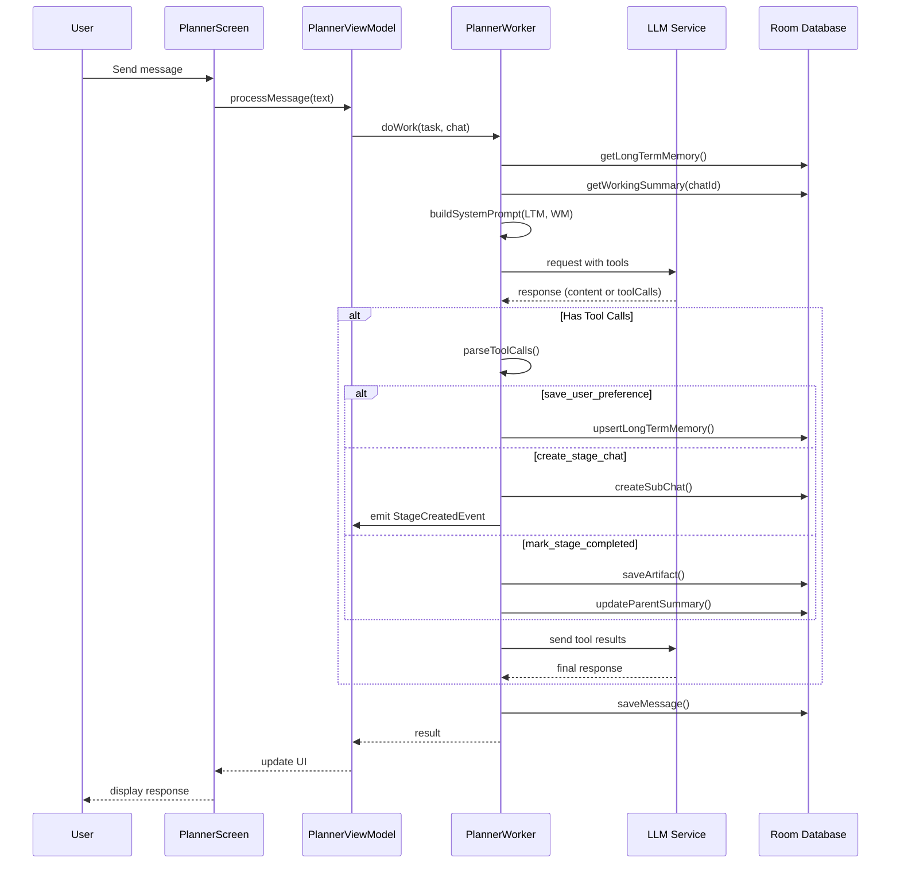

# Day 11: Planner Chat Group - Implementation Plan

## Executive Summary

This plan outlines the implementation of a new **PLANNER** chat group type that introduces a hierarchical task decomposition system with three-layer memory architecture: **Short-term**, **Working**, and **Long-term** memory.

---

## Current Architecture Analysis

### Existing Chat Group Types
1. **SIMPLE_HISTORY** - Basic chat history without agent context
2. **AGENT_COMMANDS** - Agent-enabled chats with context management via TalkWorker

### Key Architectural Components
- **Clean Architecture**: Domain/Data/UI layer separation
- **Feature-based modules**: Each feature has api/impl structure
- **Worker pattern**: AWorker implementations for different command types
- **ContextStrategy**: Manages conversation history optimization
- **Dagger DI**: Manual dependency injection with scoped components
- **Room Database**: Local persistence with relations

### Integration Points Identified
1. **ChatType enum** - Add PLANNER type
2. **ChatEntity** - Add parent_id and working_summary fields
3. **Navigation** - MainActivity sealed interface Screen
4. **Worker system** - Create new PlannerWorker alongside existing workers
5. **Console feature** - Route PLANNER groups to new UI flow

---

## Task Feasibility Assessment

### Complexity Level: **MEDIUM-HIGH**

**Why it's achievable:**
- Well-established patterns in codebase (Worker, Strategy, Feature modules)
- Existing database schema can be extended
- Clear separation of concerns allows incremental implementation

**Key challenges:**
1. Function calling support in LLM layer requires extending existing models
2. Navigation between parent planner and child stage chats needs careful state management
3. Memory injection into system prompts requires coordination between layers

**Risk Mitigation:**
- Implement MVP version first (simplified tool calling)
- Use existing TalkWorker patterns as template
- Leverage existing Room relations for chat hierarchy

---

## Three-Layer Memory Architecture

```mermaid
graph TB
    subgraph MemoryModel[Memory Model]
        direction TB
        
        subgraph STM[Short-term Memory]
            M[Messages Table<br/>Recent N messages]
        end
        
        subgraph WM[Working Memory]
            WS[ChatEntity.working_summary<br/>Current task context]
        end
        
        subgraph LTM[Long-term Memory]
            MEM[LongTermMemoryEntity<br/>User profile & facts]
        end
    end
    
    subgraph LLM[LLM Request]
        SP[System Prompt Injection]
        SP --> |{{LTM_CONTEXT}}| LTM
        SP --> |{{WORKING_SUMMARY}}| WM
        SP --> |messages[]| STM
    end
    
    subgraph Tools[Agent Tools]
        T1[save_user_preference<br/>→ LTM]
        T2[create_stage_chat<br/>→ WM + New Chat]
        T3[mark_stage_completed<br/>→ Artifact + Parent Update]
    end
```

---

## Implementation Phases

### Phase 1: Database Foundation
**Goal**: Extend schema to support memory layers and chat hierarchy

1. **Add PLANNER to ChatType enum**
   - Location: `chat/domain/model/ChatType.kt`
   - Add `PLANNER("planner", "Project Planner")`

2. **Extend ChatEntity**
   - Add `@ColumnInfo(name = "parent_id") val parentId: Long? = null`
   - Add `@ColumnInfo(name = "working_summary") val workingSummary: String? = null`
   - Add `@ColumnInfo(name = "status") val status: ChatStatus = ChatStatus.ACTIVE`

3. **Create LongTermMemoryEntity**
   ```kotlin
   @Entity(tableName = "long_term_memory")
   data class LongTermMemoryEntity(
       @PrimaryKey
       @ColumnInfo(name = "memory_key") val memoryKey: String,
       @ColumnInfo(name = "category") val category: String,
       @ColumnInfo(name = "fact") val fact: String,
       @ColumnInfo(name = "updated_at") val updatedAt: Long = System.currentTimeMillis()
   )
   ```

4. **Create ProjectArtifactEntity**
   ```kotlin
   @Entity(tableName = "project_artifacts")
   data class ProjectArtifactEntity(
       @PrimaryKey(autoGenerate = true) val id: Long = 0,
       @ColumnInfo(name = "chat_id") val chatId: Long,
       @ColumnInfo(name = "stage_title") val stageTitle: String,
       @ColumnInfo(name = "content") val content: String,
       @ColumnInfo(name = "created_at") val createdAt: Long = System.currentTimeMillis()
   )
   ```

5. **Update ChatDatabase**
   - Add new entities to @Database annotation
   - Increment version number
   - Create migration if needed

### Phase 2: Domain Layer - Memory Management
**Goal**: Implement repositories and use cases for memory operations

1. **LongTermMemoryRepository**
   - `suspend fun upsertFact(key: String, category: String, fact: String)`
   - `suspend fun getAllFacts(): List<LongTermMemory>`
   - `fun getAllFactsFlow(): Flow<List<LongTermMemory>>`
   - `suspend fun deleteFact(key: String)`

2. **ArtifactRepository**
   - `suspend fun saveArtifact(chatId: Long, stageTitle: String, content: String)`
   - `suspend fun getArtifactsForParent(parentChatId: Long): List<Artifact>`
   - `fun getArtifactsFlow(chatId: Long): Flow<List<Artifact>>`

3. **Extended ChatRepository**
   - `suspend fun createSubChat(parentId: Long, title: String, workingSummary: String): Long`
   - `suspend fun updateWorkingSummary(chatId: Long, summary: String)`
   - `suspend fun updateChatStatus(chatId: Long, status: ChatStatus)`
   - `fun getSubChatsFlow(parentId: Long): Flow<List<Chat>>`
   - `suspend fun completeStage(chatId: Long, outcome: String)`

### Phase 3: LLM Integration - Function Calling
**Goal**: Enable LLM to invoke tools for memory and chat management

1. **Extend LLM Request Models**
   ```kotlin
   data class ModelRequest(
       val model: String,
       val messages: List<Message>,
       val tools: List<ToolDefinition>? = null,
       val toolChoice: String? = null
   )
   
   data class ToolDefinition(
       val name: String,
       val description: String,
       val parameters: JsonObject
   )
   ```

2. **Extend LLM Response Models**
   ```kotlin
   data class ModelResult(
       val content: String?,
       val toolCalls: List<ToolCall>? = null
   )
   
   data class ToolCall(
       val id: String,
       val name: String,
       val arguments: String  // JSON string
   )
   ```

3. **Create Tool Definitions**
   ```kotlin
   object PlannerTools {
       val SAVE_USER_PREFERENCE = ToolDefinition(
           name = "save_user_preference",
           description = "Save important user fact to long-term memory",
           parameters = buildJsonObject {
               put("memory_key", JsonObject(...))
               put("category", JsonObject(...))
               put("fact", JsonObject(...))
           }
       )
       
       val CREATE_STAGE_CHAT = ToolDefinition(...)
       val MARK_STAGE_COMPLETED = ToolDefinition(...)
   }
   ```

### Phase 4: Agent & Worker Implementation
**Goal**: Create PlannerWorker and supporting infrastructure

1. **Create PlannerWorker**
   ```kotlin
   class PlannerWorker @Inject constructor(
       private val aiAgentFactory: AIAgentFactory,
       private val memoryRepository: LongTermMemoryRepository,
       private val chatRepository: ChatRepository,
       private val artifactRepository: ArtifactRepository,
       private val chatTools: ChatTools
   ) : AWorker {
       override suspend fun doWork(task: String, chat: Chat, onEvent: ...) {
           // 1. Retrieve LTM and Working Memory
           // 2. Build system prompt with memory injection
           // 3. Call LLM with tools
           // 4. Handle tool calls if present
           // 5. Save response to chat
       }
   }
   ```

2. **Create ToolCallHandler Interface**
   ```kotlin
   interface ToolCallHandler {
       suspend fun handle(toolCall: ToolCall, chat: Chat): ToolResult
   }
   ```

3. **Implement Tool Handlers**
   - `SaveUserPreferenceHandler`
   - `CreateStageChatHandler`
   - `MarkStageCompletedHandler`

4. **Create PlannerSystemPromptBuilder**
   ```kotlin
   class PlannerSystemPromptBuilder {
       fun build(ltmFacts: List<LongTermMemory>, workingSummary: String?): String {
           return """
               ### ROLE
               You are a Project Planner AI assistant...
               
               ### LONG-TERM MEMORY
               ${ltmFacts.joinToString("\n") { "- [${it.category}] ${it.fact}" }}
               
               ### WORKING MEMORY
               Current project context: ${workingSummary ?: "New project"}
               
               ### AVAILABLE TOOLS
               ...
           """.trimIndent()
       }
   }
   ```

### Phase 5: UI Layer - Planner Feature
**Goal**: Create screens and components for planner workflow

1. **Create Planner Feature Module Structure**
   ```
   features/planner/
   ├── api/
   │   └── PlannerFeatureEntry.kt
   └── impl/
       ├── PlannerFeatureEntryImpl.kt
       ├── di/
       │   ├── PlannerFeatureComponent.kt
       │   ├── PlannerFeatureModule.kt
       │   └── PlannerFeatureDeps.kt
       └── ui/
           ├── PlannerScreen.kt
           ├── StageChatScreen.kt
           ├── RoadmapView.kt
           ├── ArtifactsScreen.kt
           ├── components/
           │   ├── StageCard.kt
           │   ├── RoadmapTree.kt
           │   └── MemorySidebar.kt
           └── viewmodel/
               ├── PlannerViewModel.kt
               └── StageChatViewModel.kt
   ```

2. **PlannerScreen Components**
   - Chat interface (reuse existing message components)
   - Roadmap/Tree view showing stages hierarchy
   - FAB to view artifacts/solution
   - Drawer for LTM sidebar

3. **StageChatScreen**
   - Standard chat interface
   - Visual indicator showing parent context
   - "Complete Stage" button (or automatic via LLM)

4. **RoadmapView**
   - Tree visualization of planner → stages
   - Status indicators (TODO, IN_PROGRESS, DONE)
   - Click to navigate to stage

### Phase 6: Navigation & Integration
**Goal**: Wire everything together in the app

1. **Update MainActivity Navigation**
   ```kotlin
   sealed interface Screen {
       data object GroupChoice : Screen
       data class Chats(val groupId: Long) : Screen
       data class Planner(val groupId: Long) : Screen  // NEW
       data class StageChat(val chatId: Long, val parentId: Long) : Screen  // NEW
   }
   ```

2. **Update GroupChoice Screen**
   - Add option to create PLANNER type group
   - Visual distinction for planner groups in grid

3. **Update Chats Feature**
   - Route PLANNER groups to PlannerFeature instead of Console
   - Regular groups continue to Console

4. **DI Configuration**
   - Add PlannerWorker to AgentCoreFeatureModule
   - Create PlannerFeatureComponent
   - Provide PlannerFeatureEntry from AppComponent

---

## Data Flow Architecture



---

## File Structure Summary

### New Files to Create

**Database Layer (8 files)**
- `chat/data/local/model/LongTermMemoryEntity.kt`
- `chat/data/local/model/ProjectArtifactEntity.kt`
- `chat/data/local/dao/LongTermMemoryDao.kt`
- `chat/data/local/dao/ArtifactDao.kt`
- `chat/domain/model/LongTermMemory.kt`
- `chat/domain/model/Artifact.kt`
- `chat/domain/repository/LongTermMemoryRepository.kt`
- `chat/data/repository/LongTermMemoryRepositoryImpl.kt`

**Domain Layer (6 files)**
- `agent/domain/workers/PlannerWorker.kt`
- `agent/domain/tools/ToolCallHandler.kt`
- `agent/domain/tools/SaveUserPreferenceHandler.kt`
- `agent/domain/tools/CreateStageChatHandler.kt`
- `agent/domain/tools/MarkStageCompletedHandler.kt`
- `agent/domain/prompt/PlannerSystemPromptBuilder.kt`

**LLM Layer (3 files)**
- `llm/domain/model/ToolDefinition.kt`
- `llm/domain/model/ToolCall.kt`
- `llm/data/remote/mappers/ToolCallMapper.kt`

**UI Layer - Planner Feature (12 files)**
- `features/planner/api/PlannerFeatureEntry.kt`
- `features/planner/impl/PlannerFeatureEntryImpl.kt`
- `features/planner/impl/di/PlannerFeatureComponent.kt`
- `features/planner/impl/di/PlannerFeatureModule.kt`
- `features/planner/impl/di/PlannerFeatureDeps.kt`
- `features/planner/impl/ui/PlannerScreen.kt`
- `features/planner/impl/ui/StageChatScreen.kt`
- `features/planner/impl/ui/RoadmapView.kt`
- `features/planner/impl/ui/ArtifactsScreen.kt`
- `features/planner/impl/ui/components/StageCard.kt`
- `features/planner/impl/ui/components/RoadmapTree.kt`
- `features/planner/impl/ui/viewmodel/PlannerViewModel.kt`

### Files to Modify

**Database (2 files)**
- `chat/data/local/model/ChatEntity.kt` - Add parent_id, working_summary, status
- `chat/data/local/ChatDatabase.kt` - Add new entities, version bump

**Domain (2 files)**
- `chat/domain/model/ChatType.kt` - Add PLANNER type
- `chat/domain/ChatRepository.kt` - Add sub-chat methods

**LLM (2 files)**
- `llm/domain/model/ModelRequest.kt` - Add tools support
- `llm/domain/model/ModelResult.kt` - Add toolCalls support

**App Level (2 files)**
- `MainActivity.kt` - Add Planner navigation
- `app/di/AppComponent.kt` - Expose PlannerFeatureEntry

---

## MVP vs Full Implementation

### MVP Scope (Recommended for First Iteration)

**Included:**
- Database schema changes (LTM, working_summary, parent_id)
- Single tool: `save_user_preference` (basic LTM management)
- Manual stage creation (UI button instead of LLM tool)
- Simple list view of stages (no tree visualization)
- Basic artifact display

**Excluded:**
- Function calling via LLM (use button triggers instead)
- Automatic stage completion detection
- Complex tree visualization
- Undo/redo system
- Merge stage functionality

### Full Scope (Future Iterations)

- Full Function Calling support with all 3 tools
- Automatic stage creation and completion via LLM
- Rich tree visualization with animations
- Undo/redo with ActionHistory
- Stage merging capabilities
- Deep linking to stages
- LTM sidebar with editing

---

## Open Questions for Clarification

Before proceeding with implementation, I need clarification on the following:

### 1. LLM Function Calling Support
**Question**: Does the current LLM provider/API support function calling/tools?
- OpenAI supports it natively
- Some local models may not
- This affects whether we implement "real" function calling or simulate it with prompt parsing

**Impact**: If no native support, we'll use pattern matching on LLM responses instead of formal tool calls.

### 2. Default Agent Configuration
**Question**: Should the PLANNER group type use a specific default agent configuration?
- Should we create a new agent type "planner_agent"?
- Or reuse existing "talk_agent" with different system prompt?
- Should there be separate agents for planner vs stage chats?

**Impact**: Determines DI setup and agent factory logic.

### 3. Stage Chat Behavior
**Question**: When a user is in a stage chat, which worker handles messages?
- Option A: Same PlannerWorker (simpler, one worker type)
- Option B: Different StageWorker (more flexible, different tools)
- Option C: Reuse TalkWorker (minimal new code)

**Impact**: Affects worker architecture and which tools are available in stage chats.

### 4. Parent-Child Navigation
**Question**: How should navigation between planner and stages work?
- Should stage chats appear in the same list as regular chats?
- Or in a separate "Roadmap" view?
- Can user create regular chats in a PLANNER group?

**Impact**: Affects UI design and chat listing queries.

### 5. Working Memory Scope
**Question**: At what level should working_summary be stored?
- Option A: At ChatEntity level (each chat has its own working context)
- Option B: At ChatGroup level (shared context for all chats in group)
- Option C: Both (group-level + per-chat override)

**Impact**: Database schema and context retrieval logic.

### 6. Migration Strategy
**Question**: Should we preserve existing chat data during migration?
- Current database version is 4
- Adding columns to ChatEntity requires migration
- New tables don't require migration

**Impact**: If yes, we need to write Migration(4, 5) object.

---

## Next Steps

1. **Await clarification** on the questions above
2. **Create detailed technical specification** for each phase
3. **Start with Phase 1** (Database) as it's foundational
4. **Iterate through phases** with testing at each step
5. **Final integration testing** of the complete flow

---

## Estimated Scope Assessment

**Is the task overcomplicated?**

The full implementation described in the briefing is comprehensive but not overcomplicated. The key is proper phasing:

- **MVP can be achieved** with ~60% of the planned work
- **Core memory layers** (LTM, Working, Short-term) are straightforward with Room
- **Tool calling** is the most complex part but can be simplified for MVP
- **UI components** are mostly compositions of existing patterns

**Recommendations to avoid complexity creep:**
1. Start with manual stage creation (not LLM-driven)
2. Use simple list instead of tree visualization initially
3. Implement only save_user_preference tool first
4. Skip undo/redo system in MVP

---

## Architecture Compliance

The plan adheres to project architecture rules:

| Rule | Compliance |
|------|------------|
| Clean Architecture | Domain/Data/UI separation maintained |
| Dagger (not Hilt) | Manual DI with components and scopes |
| Room with explicit columns | @ColumnInfo on all entity fields |
| Kotlinx Serialization | @SerialName for all network models |
| Immutable collections | Using ImmutableList in UI layer |
| Feature module structure | api/impl separation for Planner feature |
| ViewModel Factory pattern | Will use Factory for PlannerViewModel |

---

## Conclusion

This implementation plan provides a clear roadmap for adding the PLANNER chat group type with three-layer memory architecture. The approach balances:

- **Architectural integrity** (following existing patterns)
- **Incremental delivery** (MVP first, full features later)
- **User value** (working solution at each phase)

The plan requires clarification on 6 key questions before proceeding to implementation.