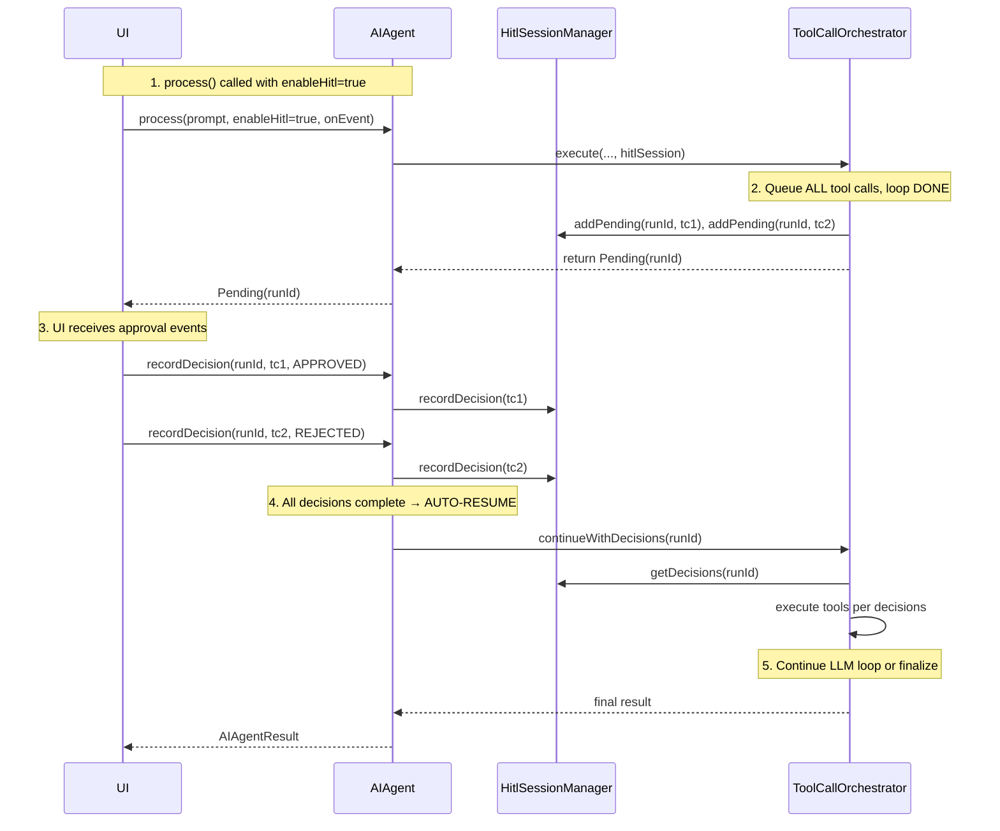

# Human-in-the-Loop (HITL) Design for AIAgent

## Status: DRAFT

## Context

AIAgent currently executes tool calls automatically. To support human oversight and approval, we need a mechanism for pausing tool execution pending user confirmation.

## Goals

1. All tool calls require human approval before execution (when HITL enabled)
2. Session tracked by `runId` — auto-generated when HITL enabled
3. Batch queue — when LLM returns multiple tool calls, ALL are queued before any execute
4. Orchestrator loop completes when returning pending — no waiting/polling
5. `recordDecision()` auto-resumes agent when all decisions are recorded
6. AIAgent remains simple and configurable
7. Serializable data structures for future server migration

## Architecture Overview



## Key Design Decision: Reuse Existing Classes

**Problem with hitl-design.md and hitl-design2.md:** Both create `PendingToolCall` that duplicates `ModelResult.Success.ToolCall`.

**Solution:** Reuse existing `ModelResult.Success.ToolCall` directly as the tool call reference. No new class needed for pending state.

| Existing Class | Purpose | HITL Role |
|---------------|---------|-----------|
| `ModelResult.Success.ToolCall` | Tool call from LLM response | Use directly as pending reference |
| `ToolCallSession` | Holds `AssistantToolCall` + `List<ToolResult>` | Post-execution tracking |
| `ToolResult` | Single tool execution result | Use for approved tool results |

## Core Components

### 1. HitlSession (Domain Model)

Located: `domain/tools/hitl/HitlSession.kt`

```kotlin
data class HitlSession(
    val runId: String,
    val agentId: Long,
    val status: HitlStatus = HitlStatus.RUNNING,
    val pendingToolCalls: List<ModelResult.Success.ToolCall> = emptyList(),
    val decisions: Map<String, ToolCallDecision> = emptyMap(),
    val processedToolCallIds: Set<String> = emptySet(),
    val loopIndex: Int = 0,  // Which iteration we were on
    val lastAssistantMessage: ModelRequest.Message? = null,  // Assistant msg with tool_calls
    val prompt: AContextMessage? = null  // For contextMessages reconstruction
)

enum class HitlStatus {
    RUNNING,
    AWAITING_APPROVAL,
    COMPLETED,
    CANCELLED
}

enum class ToolCallDecision {
    APPROVED,
    REJECTED
}
```

**Key insight about messages:** Messages are NOT stored in HitlSession. On resume, messages are RECONSTRUCTED from:
- `initialHistory` — from DB via strategy.process() (unchanged)
- `memoryMessages` — re-fetched from memoryProvider.getMemoryContext() (deterministic)
- `contextMessages` — re-fetched from memoryProvider.appendUserPrompt() (deterministic given same prompt)
- `prompt` — passed to process(), stored in DB after completion

This avoids message duplication while ensuring correct state restoration after crash.

### 2. HitlSessionManager

Located: `domain/tools/hitl/HitlSessionManager.kt`

```kotlin
interface HitlSessionManager {
    fun createSession(agentId: Long): String
    fun getSession(runId: String): HitlSession?
    fun hasActiveSession(agentId: Long): Boolean
    fun addPending(
        runId: String,
        toolCalls: List<ModelResult.Success.ToolCall>,
        assistantMessage: ModelRequest.Message,
        loopIndex: Int
    )
    fun recordDecision(runId: String, toolCallId: String, decision: ToolCallDecision): RecordDecisionResult
    fun areAllDecisionsRecorded(runId: String): Boolean
    fun getDecision(runId: String, toolCallId: String): ToolCallDecision?
    fun getAllDecisions(runId: String): Map<String, ToolCallDecision>
    fun markProcessed(runId: String, toolCallId: String)
    fun closeSession(runId: String)
}

sealed class RecordDecisionResult {
    object AllComplete : RecordDecisionResult()
    object AwaitingMore : RecordDecisionResult()
    data class Error(val message: String) : RecordDecisionResult()
}
```

**Implementation:** Use in-memory `ConcurrentHashMap` for thread safety. Can add database persistence later.

### 3. ProcessResult Union Type

Located: `domain/model/ProcessResult.kt`

```kotlin
/**
 * Result of AIAgent.process() when HITL is enabled.
 * Distinguishes between completion and pending-approval states.
 */
sealed class ProcessResult {
    data class Success(val result: AIAgentResult) : ProcessResult()
    data class Pending(val runId: String) : ProcessResult()
}
```

**Note:** This wraps `Result<AIAgentResult>`, not replaces it. AIAgent.process() returns `Result<ProcessResult>`.

### 4. AgentConfig Update

Located: `domain/model/AgentConfig.kt`

```kotlin
data class AgentConfig(
    // ... existing fields ...
    /** Enable human-in-the-loop for tool calls */
    val hitlEnabled: Boolean = false
)
```

### 5. WorkerEvent Additions

Located: `domain/workers/base/WorkerEvent.kt`

```kotlin
sealed interface WorkerEvent {
    // ... existing events ...

    /** Emitted when tool call needs human approval */
    data class ApprovalRequired(
        val runId: String,
        val toolCall: ModelResult.Success.ToolCall
    ) : WorkerEvent()

    /** Emitted when user makes a decision */
    data class ApprovalDecided(
        val runId: String,
        val toolCallId: String,
        val decision: ToolCallDecision
    ) : WorkerEvent()
}
```

**Note:** Uses existing `ModelResult.Success.ToolCall` directly.

### 6. ToolCallOrchestrator Interface Changes

Located: `domain/tools/ToolCallOrchestrator.kt`

```kotlin
interface ToolCallOrchestrator {
    suspend fun execute(
        initialHistory: List<ModelRequest.Message>,
        memoryMessages: List<AContextMessage>,
        contextMessages: List<AContextMessage>,
        prompt: AContextMessage,
        systemPrompt: String?,
        modelSettings: ModelSettings,
        tools: List<ModelRequest.Tool>,
        context: ToolCallContext,
        hitlSession: HitlSession?,  // NEW: null = no HITL, session = HITL enabled
        onEvent: (suspend (WorkerEvent) -> Unit)?
    ): Result<ToolCallingResult>

    suspend fun continueWithDecisions(
        runId: String,
        session: HitlSession,
        initialHistory: List<ModelRequest.Message>,
        memoryMessages: List<AContextMessage>,
        contextMessages: List<AContextMessage>,
        prompt: AContextMessage,
        systemPrompt: String?,
        modelSettings: ModelSettings,
        decisions: Map<String, ToolCallDecision>,
        context: ToolCallContext,
        onEvent: (suspend (WorkerEvent) -> Unit)?
    ): Result<ToolCallingResult>
}
```

### 7. AIAgent Changes

Located: `domain/AIAgent.kt`

```kotlin
class AIAgent(
    val config: AgentConfig,
    private val contextRepository: AgentContextRepository,
    private val llmProvider: LlmRequestUseCase,
    private val strategy: ContextStrategy,
    private val memoryProvider: MemoryProvider,
    private val toolProvider: ToolProvider,
    private val orchestrator: ToolCallOrchestrator,
    private val hitlSessionManager: HitlSessionManager  // NEW dependency
) {
    suspend fun process(
        prompt: AContextMessage,
        onEvent: (suspend (WorkerEvent) -> Unit)?
    ): Result<ProcessResult> {
        // Check if session already active for this agent (HITL is per-agent via config.hitlEnabled)
        if (config.hitlEnabled && hitlSessionManager.hasActiveSession(config.id)) {
            onEvent?.invoke(WorkerEvent.RequestError("session_busy"))
            return Result.failure(HitlSessionBusyError())
        }

        // Auto-create session if HITL enabled
        val hitlSession = if (config.hitlEnabled) {
            val runId = hitlSessionManager.createSession(config.id)
            hitlSessionManager.getSession(runId)?.copy(prompt = prompt)
        } else null

        val result = orchestrator.execute(
            initialHistory = snapshot.messages.toModelRequestMessages(),
            memoryMessages = memoryMessages,
            contextMessages = promptMessages.context,
            prompt = promptMessages.prompt,
            systemPrompt = config.systemPrompt,
            modelSettings = config.modelSettings,
            tools = toolProvider.getTools(agentId = config.id),
            context = ToolCallContext(agentId = config.id),
            hitlSession = hitlSession,
            onEvent = onEvent
        )

        return result.map { toolCallingResult ->
            if (hitlSession != null && orchestrator.isWaitingForHitl()) {
                // Return Pending - orchestrator queued tool calls for approval
                ProcessResult.Pending(hitlSession.runId)
            } else {
                // Complete - cleanup session if exists
                hitlSession?.runId?.let { hitlSessionManager.closeSession(it) }
                ProcessResult.Success(AIAgentResult(...))
            }
        }
    }

    suspend fun recordDecision(
        runId: String,
        toolCallId: String,
        decision: ToolCallDecision
    ): Boolean {
        val result = hitlSessionManager.recordDecision(runId, toolCallId, decision)

        return when (result) {
            is RecordDecisionResult.AllComplete -> {
                // Auto-resume agent execution
                continueWithDecisions(runId)
                true
            }
            is RecordDecisionResult.AwaitingMore -> false
            is RecordDecisionResult.Error -> false
        }
    }

    private suspend fun continueWithDecisions(runId: String): Boolean {
        val session = hitlSessionManager.getSession(runId) ?: return false

        // Reconstruct context using stored prompt
        val storedPrompt = session.prompt ?: return false
        val memoryMessages = memoryProvider.getMemoryContext()
        val promptMessages = memoryProvider.appendUserPrompt(storedPrompt)
        val snapshot = strategy.process(config, contextRepository)

        val result = orchestrator.continueWithDecisions(
            runId = runId,
            session = session,
            initialHistory = snapshot.messages.toModelRequestMessages(),
            memoryMessages = memoryMessages,
            contextMessages = promptMessages.context,
            prompt = promptMessages.prompt,
            systemPrompt = config.systemPrompt,
            modelSettings = config.modelSettings,
            decisions = hitlSessionManager.getAllDecisions(runId),
            context = ToolCallContext(agentId = session.agentId),
            onEvent = null
        )

        // TODO: Handle result, update context, etc.
        return result.isSuccess
    }
}

class HitlSessionBusyError : Exception("HITL session already active for this agent")
```

### 8. ToolCallOrchestratorImpl Changes

Located: `domain/tools/impl/ToolCallOrchestratorImpl.kt`

**Refactoring: Extract tool execution to helper method**

```kotlin
/**
 * Execute tools and collect results.
 * @param decisions If null, execute all tools. If provided, only execute APPROVED tools.
 */
private suspend fun executeToolCalls(
    toolCalls: List<ModelResult.Success.ToolCall>,
    decisions: Map<String, ToolCallDecision>?,
    context: ToolCallContext,
    onEvent: ((suspend (WorkerEvent) -> Unit)?)?
): Pair<List<ToolResult>, List<ModelRequest.Message>> {
    val toolResults = mutableListOf<ToolResult>()
    val toolMessages = mutableListOf<ModelRequest.Message>()

    for (call in toolCalls) {
        val shouldExecute = decisions == null || decisions[call.id] == ToolCallDecision.APPROVED

        if (shouldExecute) {
            // Emit start event
            onEvent?.invoke(
                WorkerEvent.ToolCallStarted(
                    toolCallId = call.id,
                    toolName = call.function.name,
                    arguments = call.function.arguments
                )
            )

            val result = toolProvider.executeToolCall(call, context)
            val content = result.getOrElse { error ->
                "${ToolCallingConstants.MCP_TOOL_ERROR_PREFIX}: ${error.message}"
            }

            toolMessages.add(
                ModelRequest.Message(
                    role = ModelRequest.Role.Tool,
                    content = content,
                    toolCallId = call.id
                )
            )
            toolResults.add(
                ToolResult(
                    toolCallId = call.id,
                    content = content,
                    isError = result.isFailure
                )
            )

            onEvent?.invoke(
                WorkerEvent.ToolCallFinished(
                    toolCallId = call.id,
                    toolName = call.function.name,
                    result = content,
                    isError = result.isFailure
                )
            )
        } else {
            // Rejected tool - add error message
            val content = "Rejected by user"
            toolMessages.add(
                ModelRequest.Message(
                    role = ModelRequest.Role.Tool,
                    content = content,
                    toolCallId = call.id
                )
            )
            toolResults.add(
                ToolResult(
                    toolCallId = call.id,
                    content = content,
                    isError = true
                )
            )
        }
    }

    return Pair(toolResults, toolMessages)
}
```

**Key changes in execute() method:**

```kotlin
override suspend fun execute(
    // ... existing params ...
    hitlSession: HitlSession?,
    onEvent: (suspend (WorkerEvent) -> Unit)?
): Result<ToolCallingResult> {
    // ... LLM call and response handling ...

    val toolCalls = llmResult.choices.firstOrNull()?.message?.toolCalls

    if (toolCalls.isNullOrEmpty()) {
        // No tool calls - return result normally
        return Result.success(createResult(...))
    }

    // HITL: Queue ALL tool calls and return
    if (hitlSession != null) {
        // Store assistant message with tool_calls for later resume
        val assistantMsg = ModelRequest.Message(
            role = ModelRequest.Role.Assistant,
            content = choice.message.content.orEmpty(),
            toolCalls = toolCalls.map { call ->
                ModelRequest.ToolCall(
                    id = call.id,
                    type = call.type,
                    function = ModelRequest.FunctionCall(
                        name = call.function.name,
                        arguments = call.function.arguments
                    )
                )
            }
        )

        // Update session with pending state
        hitlSessionManager.addPending(hitlSession.runId, toolCalls, assistantMsg, loopIndex)

        // Emit ApprovalRequired for EACH
        for (call in toolCalls) {
            onEvent?.invoke(
                WorkerEvent.ApprovalRequired(
                    runId = hitlSession.runId,
                    toolCall = call
                )
            )
        }

        // Return pending result - messages stored in session for resume
        return Result.success(
            ToolCallingResult(
                finalResponseText = "",
                toolCallSessions = listOf(
                    ToolCallSession(
                        assistantMessage = AssistantToolCall(
                            content = choice.message.content,
                            toolCalls = toolCalls
                        ),
                        toolResults = emptyList()
                    )
                ),
                allMessages = newMessages
            )
        )
    }

    // No HITL - execute all immediately (existing logic)
    // ...
}
```

**New fields in ToolCallingResult:**

```kotlin
data class ToolCallingResult(
    val finalResponseText: String,
    val toolCallSessions: List<ToolCallSession>,
    val allMessages: List<AContextMessage>
)
```

**continueWithDecisions implementation:**

```kotlin
override suspend fun continueWithDecisions(
    runId: String,
    session: HitlSession,
    initialHistory: List<ModelRequest.Message>,
    memoryMessages: List<AContextMessage>,
    contextMessages: List<AContextMessage>,
    prompt: AContextMessage,
    systemPrompt: String?,
    modelSettings: ModelSettings,
    decisions: Map<String, ToolCallDecision>,
    context: ToolCallContext,
    onEvent: (suspend (WorkerEvent) -> Unit)?
): Result<ToolCallingResult> {
    // Reconstruct messages list (same logic as in execute())
    val messages = (memoryMessages.map { it.toModelRequestMessage() } + initialHistory).toMutableList()
    contextMessages.forEach { if (it.content.isNotBlank()) messages.add(it.toModelRequestMessage()) }

    val newMessages = mutableListOf<ModelRequest.Message>()
    newMessages.addAll(initialHistory)

    if (prompt.content.isNotBlank()) {
        messages.add(prompt.toModelRequestMessage())
        newMessages.add(prompt.toModelRequestMessage())
    }

    // Add the assistant message with tool_calls that was stored during execute()
    val assistantMessage = session.lastAssistantMessage
        ?: return Result.failure(IllegalStateException("No assistant message in session"))
    messages.add(assistantMessage)
    newMessages.add(assistantMessage)

    // Execute tools based on decisions
    val (toolResults, toolMessages) = executeToolCalls(
        session.pendingToolCalls,
        decisions,
        context,
        onEvent
    )

    // Add tool messages to history
    messages.addAll(toolMessages)
    newMessages.addAll(toolMessages)

    // Continue LLM loop with results (same as original execute() after tool execution)
    return continueLlmLoop(
        messages = messages,
        newMessages = newMessages,
        systemPrompt = systemPrompt,
        modelSettings = modelSettings,
        tools = toolProvider.getTools(agentId = context.agentId),
        loopIndex = session.loopIndex + 1,
        onEvent = onEvent
    )
}

/**
 * Continue LLM loop after tool execution.
 * Reuses existing loop logic from execute().
 */
private suspend fun continueLlmLoop(...): Result<ToolCallingResult> {
    // Same implementation as the while loop in execute()
    // Starting from loopIndex parameter
    // ...
}
```

    for (call in toolCalls) {
        val decision = decisions[call.id]

        when (decision) {
            ToolCallDecision.APPROVED -> {
                val result = toolProvider.executeToolCall(call, context)
                val content = result.getOrElse { error ->
                    "${ToolCallingConstants.MCP_TOOL_ERROR_PREFIX}: ${error.message}"
                }

                toolMessages.add(
                    ModelRequest.Message(
                        role = ModelRequest.Role.Tool,
                        content = content,
                        toolCallId = call.id
                    )
                )
                toolResults.add(
                    ToolResult(
                        toolCallId = call.id,
                        content = content,
                        isError = result.isFailure
                    )
                )
                hitlSessionManager.markProcessed(runId, call.id)
            }
            ToolCallDecision.REJECTED -> {
                val content = "Rejected by user"
                toolMessages.add(
                    ModelRequest.Message(
                        role = ModelRequest.Role.Tool,
                        content = content,
                        toolCallId = call.id
                    )
                )
                toolResults.add(
                    ToolResult(
                        toolCallId = call.id,
                        content = content,
                        isError = true
                    )
                )
                hitlSessionManager.markProcessed(runId, call.id)
            }
            null -> {
                // Skip - not yet decided
            }
        }

        onEvent?.invoke(
            WorkerEvent.ApprovalDecided(runId, call.id, decision ?: ToolCallDecision.REJECTED)
        )
    }

    // Continue LLM loop with tool results
    // ... (add tool messages to history and call LLM again)

    return Result.success(
        ToolCallingResult(
            finalResponseText = finalText,
            toolCallSessions = listOf(
                ToolCallSession(
                    assistantMessage = storedSession.assistantMessage,
                    toolResults = toolResults
                )
            ),
            allMessages = updatedMessages
        )
    )
}
```

## File Changes Summary

| File | Change |
|------|--------|
| `domain/tools/hitl/HitlSession.kt` | NEW — data classes |
| `domain/tools/hitl/HitlSessionManager.kt` | NEW — interface and in-memory impl |
| `domain/model/ProcessResult.kt` | NEW — Success/Pending union type |
| `domain/workers/base/WorkerEvent.kt` | MODIFY — add ApprovalRequired, ApprovalDecided |
| `domain/model/AgentConfig.kt` | MODIFY — add hitlEnabled field |
| `domain/tools/ToolCallingResult.kt` | No changes (unchanged from existing) |
| `domain/tools/ToolCallOrchestrator.kt` | MODIFY — add hitlSession param, continueWithDecisions |
| `domain/tools/impl/ToolCallOrchestratorImpl.kt` | MODIFY — implement HITL flow |
| `domain/AIAgent.kt` | MODIFY — add hitlEnabled, recordDecision, continueWithDecisions |
| `di/AgentCoreFeatureModule.kt` | MODIFY — add HitlSessionManager binding |

## About toolCallSessions

**Who needs `toolCallSessions`?**
- `AIAgent` uses `allMessages` for context persistence, NOT `toolCallSessions`
- `toolCallSessions` is for **debugging/analysis** — tracks tool call pairs (request + result)
- In non-HITL flow: returned for logging/monitoring
- In HITL flow: NOT needed for `continueWithDecisions` — uses `HitlSession.pendingToolCalls` instead

**Conclusion:** `toolCallSessions` can be kept for debugging but is not required for core HITL functionality.

## Error Handling: Rejected Tools in LLM History

When a tool is rejected, we MUST add an error result to the LLM history:

```kotlin
// In continueWithDecisions
ToolCallDecision.REJECTED -> {
    toolMessages.add(
        ModelRequest.Message(
            role = ModelRequest.Role.Tool,
            content = "Rejected by user",  // Error content
            toolCallId = call.id
        )
    )
    toolResults.add(
        ToolResult(call.id, "Rejected by user", isError = true)
    )
}
```

This ensures the LLM understands that the tool was rejected and can formulate an appropriate response.

## Session Timeout

Sessions should have a timeout to prevent orphaned sessions:

```kotlin
// In HitlSessionManager
data class HitlSession(
    // ...
    val createdAt: Long = System.currentTimeMillis()
)

// Check for timeout in hasActiveSession or cleanup
private fun isTimedOut(session: HitlSession): Boolean {
    return System.currentTimeMillis() - session.createdAt > SESSION_TIMEOUT_MS
}

companion object {
    private const val SESSION_TIMEOUT_MS = 24 * 60 * 60 * 1000L // 24 hours
}
```

## Testing Strategy

1. **Unit tests for HitlSessionManager** — test session lifecycle, decision recording
2. **Unit tests for ToolCallOrchestrator with HITL** — mock LLM and tool provider
3. **Integration tests for full flow** — process → pending → decisions → resume
