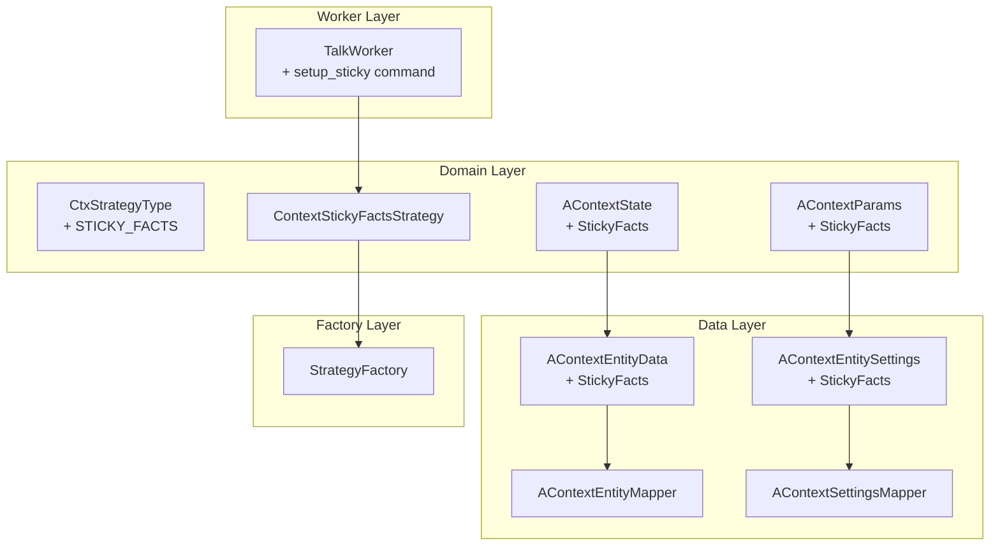

# План разработки: Sticky Facts Strategy

## Описание задачи

Добавить новый тип стратегии управления контекстом "Sticky Facts" (Key-Value Memory) в AI-чат приложение.

### Концепция
- **Sticky Facts** - отдельный блок "facts" (ключ-значение), который хранит важные данные из диалога
- **Что хранится**: цели, ограничения, предпочтения, решения, договорённости
- **Обновление**: после каждого сообщения пользователя через LLM
- **Отправка в запрос**: facts + последние N сообщений

### Активация
Стратегия активируется командой:
```
@@talk(setup_sticky --msg X --facts Y)
```
Где:
- `--msg X` - размер окна последних сообщений (обязательный)
- `--facts Y` - максимальное количество фактов (опциональный, default=20)

---

## Архитектура изменений



---

## Последовательность изменений

### Phase 1: Domain Model Extensions

#### 1. CtxStrategyType.kt
**Файл**: `app/src/main/java/com/example/day/core/core_features/agent/domain/strategy/CtxStrategyType.kt`

Добавить enum value:
```kotlin
/**
 * Стратегия sticky facts - хранит факты (key-value) + окно последних сообщений.
 */
STICKY_FACTS
```

#### 2. AContext.kt
**Файл**: `app/src/main/java/com/example/day/core/core_features/agent/domain/model/AContext.kt`

Добавить в `AContextState`:
```kotlin
data class StickyFacts(
    val facts: Map<String, String>,
    val messages: PersistentList<AContextMessage>
) : AContextState
```

Добавить в `AContextParams`:
```kotlin
data class StickyFacts(
    val windowSize: Int,
    val maxFacts: Int = 20
) : AContextParams
```

---

### Phase 2: Data Layer Extensions

#### 3. AContextEntityData.kt
**Файл**: `app/src/main/java/com/example/day/core/core_features/agent/data/local/model/AContextEntityData.kt`

Добавить serializable класс:
```kotlin
@Serializable
data class StickyFacts(
    val facts: Map<String, String>,
    val messages: List<AContextMessageEntityData>
) : AContextEntityData
```

#### 4. AContextEntitySettings.kt
**Файл**: `app/src/main/java/com/example/day/core/core_features/agent/data/local/model/AContextEntitySettings.kt`

Добавить serializable класс:
```kotlin
@Serializable
data class StickyFacts(
    val windowSize: Int,
    val maxFacts: Int
) : AContextEntitySettings
```

#### 5. AContextEntityMapper.kt
**Файл**: `app/src/main/java/com/example/day/core/core_features/agent/data/local/mapper/AContextEntityMapper.kt`

Добавить mapping:
- `toEntityData()`: case для `AContextState.StickyFacts`
- `toDomain()`: case для `AContextEntityData.StickyFacts`

#### 6. AContextSettingsMapper.kt
**Файл**: `app/src/main/java/com/example/day/core/core_features/agent/data/local/mapper/AContextSettingsMapper.kt`

Добавить mapping:
- `toEntityData()`: case для `AContextParams.StickyFacts`
- `toDomain()`: case для `AContextEntitySettings.StickyFacts`

---

### Phase 3: Strategy Implementation

#### 7. ContextStickyFactsStrategy.kt
**Файл**: `app/src/main/java/com/example/day/core/core_features/agent/domain/strategy/impl/ContextStickyFactsStrategy.kt`

**Класс**: Реализует `ContextStrategy`

**Зависимости**: `LlmRequestUseCase`

**Методы**:

##### process()
1. Получает текущее состояние (`AContextState.StickyFacts`)
2. Получает параметры (`AContextParams.StickyFacts`)
3. Формирует блок фактов:
   ```
   CORE CONTEXT (FACTS):
   - key1: value1
   - key2: value2
   ```
4. Берет последние `windowSize` сообщений
5. Возвращает `ContextSnapshot` с SYSTEM сообщением (facts) + sliding window

##### afterResponse()
1. Обновляет историю сообщений (добавляет user prompt + response)
2. Ограничивает историю до `windowSize`
3. Формирует промпт для LLM:
   ```
   Review this conversation and update the fact map.
   
   Current facts: ${currentFacts}
   User: ${userPrompt}
   Assistant: ${response}
   
   Instructions:
   1. Keep existing facts that are still relevant
   2. Update facts that have changed
   3. Add new important facts
   4. Remove outdated facts
   5. Maximum ${maxFacts} facts total
   
   Return format:
   Key: Value
   ```
4. Вызывает LLM для получения новых фактов
5. Парсит ответ в `Map<String, String>`
6. Сохраняет обновленное состояние

##### getInfoReport()
Возвращает:
```
Стратегия: sticky facts
Размер окна: X
Максимум фактов: Y
Фактов в памяти: Z
Сообщений в окне: W
```

##### getFullContextReport()
Возвращает полный список фактов и сообщений

##### updateParams()
Обновляет `windowSize` и `maxFacts` из map параметров

##### parseFacts(raw: String): Map<String, String>
Парсит ответ LLM формата `Key: Value` в Map

---

### Phase 4: Integration

#### 8. StrategyFactory.kt
**Файл**: `app/src/main/java/com/example/day/core/core_features/agent/domain/strategy/StrategyFactory.kt`

Добавить:
- В `create(type: CtxStrategyType)`: case `STICKY_FACTS -> ContextStickyFactsStrategy(llmRequestUseCase)`
- В `create(aContext: AContextParams)`: case для `AContextParams.StickyFacts`

#### 9. ContextStrategyConstants.kt
**Файл**: `app/src/main/java/com/example/day/core/core_features/agent/domain/strategy/ContextStrategyConstants.kt`

Добавить:
```kotlin
const val PARAM_MAX_FACTS = "facts"
```

#### 10. TalkWorker.kt
**Файл**: `app/src/main/java/com/example/day/core/core_features/agent/domain/workers/TalkWorker.kt`

**Изменения**:

1. Добавить константы:
   ```kotlin
   private const val SETUP_STICKY = "setup_sticky"
   ```

2. Обновить `REGISTERED_COMMANDS`:
   ```kotlin
   private val REGISTERED_COMMANDS = setOf(INFO, CONTEXT, SETUP, SETUP_SLIDING, SETUP_STICKY)
   ```

3. Добавить case в `processCommand()`:
   ```kotlin
   SETUP_STICKY -> executeSetupStickyCommand(command.parameters, chat)
   ```

4. Реализовать `executeSetupStickyCommand()`:
   - Парсит `--msg` (обязательный)
   - Парсит `--facts` (опциональный, default=20)

5. Реализовать `setupStickyFactsStrategy()`:
   - Если текущая стратегия уже `STICKY_FACTS` - обновляет параметры
   - Иначе - мигрирует сообщения из текущей стратегии
   - Устанавливает начальное состояние: пустые facts + окно сообщений

6. Обновить `extractMessagesFromCurrentStrategy()`:
   - Добавить case для `AContextState.StickyFacts`

7. Обновить KDoc документацию:
   ```kotlin
   /**
    * ...
    * - @@talk(setup_sticky --msg X --facts Y) - настроить StickyFacts стратегию
    * ...
    */
   ```

---

## Файлы для изменения

| # | Файл | Статус |
|---|------|--------|
| 1 | `CtxStrategyType.kt` | ⬜ |
| 2 | `AContext.kt` | ⬜ |
| 3 | `AContextEntityData.kt` | ⬜ |
| 4 | `AContextEntitySettings.kt` | ⬜ |
| 5 | `AContextEntityMapper.kt` | ⬜ |
| 6 | `AContextSettingsMapper.kt` | ⬜ |
| 7 | `ContextStickyFactsStrategy.kt` | ⬜ (новый) |
| 8 | `StrategyFactory.kt` | ⬜ |
| 9 | `ContextStrategyConstants.kt` | ⬜ |
| 10 | `TalkWorker.kt` | ⬜ |

---

## Пример использования

```
Пользователь: @@talk(setup_sticky --msg 5 --facts 10)
Бот: Стратегия переключена на StickyFacts. Окно: 5 сообщений, макс. фактов: 10.

Пользователь: Мне нужно создать Android приложение на Kotlin
...
(после ответа LLM обновляет факты автоматически)

Пользователь: @@talk(info)
Бот: 
Стратегия: sticky facts
Размер окна: 5
Максимум фактов: 10
Фактов в памяти: 3
Сообщений в окне: 2

--- FACTS ---
- goal: Создать Android приложение
- language: Kotlin
- platform: Android
```

---

## Примечания по реализации

1. **Формат фактов**: Простой `Key: Value` (один факт на строку)
2. **Обновление фактов**: Делегируется LLM - передаем текущие факты + сообщения, получаем обновленный список
3. **Миграция**: При переключении с любой стратегии на StickyFacts - переносим последние N сообщений в окно
4. **Ограничение фактов**: LLM сама управляет количеством фактов в рамках maxFacts
5. **Системный промпт для экстракции**: "You are a factual memory processor. Extract and maintain key facts from conversations."

---

*План создан: 2026-03-02*
*Автор: Architect Mode*
