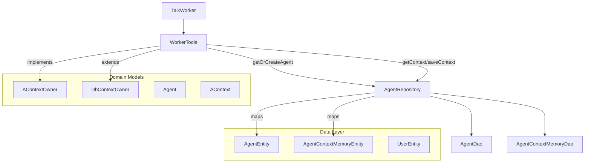

# План реализации: Сохранение контекста TalkWorker в БД

## Цель

TalkWorker должен сохранять контекст в БД и восстанавливать при перезапуске приложения.

## Текущее состояние

### Архитектура
- `TalkWorker` -> `WorkerTools` (наследует `AContextOwner`)
- `AContextOwner` -> `InMemoryContextOwner` (хранит контекст в памяти)
- `AgentRepository` уже имеет методы для сохранения/получения контекста по `agentId`

### Проблемы
1. Контекст хранится в памяти (теряется при перезапуске)
2. Нет метода для поиска агента по `systemName + isCommon`
3. `AContextOwner` использует `agentName` (String), а не `agentId` (Long)

---

## Этапы реализации

### Этап 1: Добавление методов в DAO и Repository

#### 1.1 AgentDao - добавить метод поиска
Файл: `app/src/main/java/com/example/day/core/core_features/agent/data/local/dao/AgentDao.kt`

```kotlin
@Query("SELECT * FROM agents WHERE system_name = :systemName AND is_common = :isCommon LIMIT 1")
suspend fun getBySystemNameAndIsCommon(systemName: String, isCommon: Int): AgentEntity?
```

#### 1.2 AgentRepository - добавить getOrCreateAgent
Файл: `app/src/main/java/com/example/day/core/core_features/agent/domain/AgentRepository.kt`

```kotlin
/**
 * Получить или создать агента.
 * Логика:
 * 1. Искать агента по systemName + isCommon
 * 2. Если не найден - создать нового (title = systemName)
 * 3. Если isCommon = false - привязать агента к chatId
 */
suspend fun getOrCreateAgent(
    systemName: String,
    isCommon: Boolean,
    chatId: Long
): Agent
```

---

### Этап 2: Модификация интерфейсов

#### 2.1 AContextOwner - изменить на использование agentId
Файл: `app/src/main/java/com/example/day/core/core_features/agent/domain/model/AContextOwner.kt`

```kotlin
interface AContextOwner {
    fun getContext(agentId: Long): AContext
    fun saveContext(agentId: Long, context: AContext)
}
```

#### 2.2 Создать DbContextOwner
Файл: `app/src/main/java/com/example/day/core/core_features/agent/domain/model/DbContextOwner.kt`

```kotlin
/**
 * Интерфейс для работы с контекстом агента в базе данных.
 */
interface DbContextOwner {
    /**
     * Получить контекст агента
     */
    suspend fun getAgentContext(agentId: Long): AContext?
    
    /**
     * Сохранить контекст агента
     */
    suspend fun saveAgentContext(agentId: Long, context: AContext)
}
```

---

### Этап 3: Реализация в WorkerTools

#### 3.1 WorkerTools - добавить getOrCreateAgent
Файл: `app/src/main/java/com/example/day/features/console/impl/domain/agents/WorkerTools.kt`

```kotlin
interface WorkerTools : AContextOwner {
    /**
     * Получить или создать агента для использования
     * @param systemName системное имя агента
     * @param chatId идентификатор чата
     * @param isCommonAgent агент не привязан к чату
     */
    suspend fun getOrCreateAgent(
        systemName: String,
        chatId: Long,
        isCommonAgent: Boolean
    ): Agent
    
    suspend fun createChat(chatTitle: String, groupId: Long): Long
    suspend fun getOrCreateChat(chatTitle: String, groupId: Long): Chat
    suspend fun addBotMessage(chatId: Long, message: String)
}
```

#### 3.2 Реализация вDI модуле
Необходимо добавить зависимости в `WorkerTools`:
- `AgentRepository`
- `ChatRepository` (для получения/создания UserEntity с BOT_TYPE)

---

### Этап 4: Обновление TalkWorker

Файл: `app/src/main/java/com/example/day/features/console/impl/domain/agents/worker/TalkWorker.kt`

```kotlin
override suspend fun doWork(
    task: String,
    chat: Chat,
    onEvent: (suspend (WorkerEvent) -> Unit)?
) {
    // 0. Получить инстанс своего агента
    val agent = tools.getOrCreateAgent(
        systemName = AGENT_NAME,
        chatId = chat.id,
        isCommonAgent = false  // или true - зависит от логики
    )
    
    // 1. Получить контекст агента по agentId
    val context = tools.getContext(agent.id)
    
    // 2. Подготовить историю сообщений для LLM
    val history = context.messages.toModelRequestMessages()
    
    // 3. Запрос к LLM с контекстом
    llmRequestUseCase.askLlm(
        chatSettings = chat.settings,
        userPrompt = task,
        systemPrompt = chat.settings.systemPromt,
        history = history,
        onEvent = onEvent
    ).onSuccess { result ->
        val content = result.getContent()
        
        // 4. Сохранить сообщения в контекст (используя agentId)
        val updatedContext = context
            .addUserMessage(task)
            .addAssistantMessage(content)
        tools.saveContext(agent.id, updatedContext)
        
        // 5. Отправить результат в чат
        tools.addBotMessage(chat.id, content)
    }.onFailure { exception ->
        tools.addBotMessage(chat.id, exception.stackTraceToString())
    }
}
```

---

### Этап 5: Обновление InMemoryContextOwner

Для обратной совместимости, обновить `InMemoryContextOwner`:

Файл: `app/src/main/java/com/example/day/core/core_features/agent/domain/model/InMemoryContextOwner.kt`

```kotlin
internal class InMemoryContextOwner : AContextOwner {
    
    private val contexts = mutableMapOf<Long, AContext>()  // agentId вместо agentName
    
    override fun getContext(agentId: Long): AContext {
        return contexts.getOrPut(agentId) {
            AContext(
                agentName = "",  // или получать из AgentRepository
                systemPrompt = "",
                messages = persistentListOf()
            )
        }
    }
    
    override fun saveContext(agentId: Long, context: AContext) {
        contexts[agentId] = context
    }
}
```

---

## Mermaid диаграмма: Новая архитектура



---

## Use Cases

### 1. GetOrCreateAgentUseCase
Инкапсулирует логику получения/создания агента:
- Поиск по systemName + isCommon
- Создание нового агента с использованием UserEntity (BOT_TYPE)
- Привязка к чату если isCommon = false

**Реализация:** Может быть добавлен как отдельный UseCase класс или инкапсулирован в AgentRepository.

---

## Рекомендации по реализации

1. **Транзакции**: При создании агента и привязке к чату желательно использовать транзакцию
2. **UserEntity**: При создании агента использовать существующий UserEntity с BOT_TYPE = 1
3. **Обратная совместимость**: Сохранить InMemoryContextOwner для тестирования

---

## Файлы для изменения

| Файл | Изменение |
|------|-----------|
| `AgentDao.kt` | Добавить getBySystemNameAndIsCommon |
| `AgentRepository.kt` | Добавить getOrCreateAgent |
| `AgentRepositoryImpl.kt` | Реализовать getOrCreateAgent |
| `AContextOwner.kt` | Изменить сигнатуру на agentId |
| `DbContextOwner.kt` | Создать новый интерфейс |
| `InMemoryContextOwner.kt` | Обновить для совместимости |
| `WorkerTools.kt` | Добавить getOrCreateAgent |
| `TalkWorker.kt` | Использовать getOrCreateAgent |
